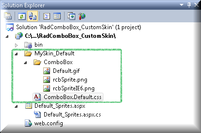
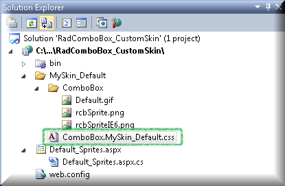
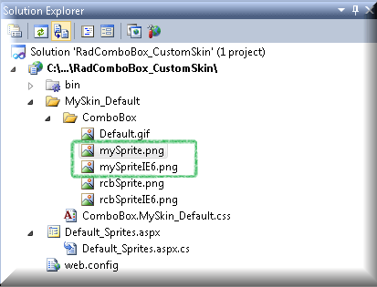
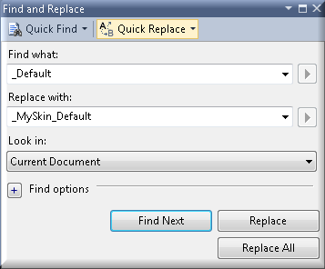
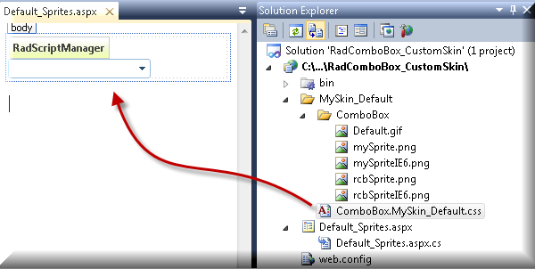

# Controlling Appearance

The following tutorial demonstrates two approaches to creating a custom RadComboBox skin using the Default and Metro skins as a base. These new skins will use a new graphic for the drop down button toggle, new background color for selected items and a new style for disabled items. See [Understanding the Skin CSS File]() for more information on specific CSS file properties.

The Default skin uses sprite images to style the appearance of the RadComboBox. The Metro skin uses a simple images and CSS to style the RadComboBox. It uses CSS3 to round the corners of the input area and the drop-down-list of RadComboBox, which is not visualized as such in IE7,8 and older version of the other browsers supported by the RadControls for ASP.NET AJAX.

## Using the Default skin as a base

**Prepare the Project**

1. In a new AJAX enabled application web form, add a **RadComboBox.** Set the **EnabledEmbeddedSkins** property to **false.**

2. In the Solution Explorer, create a new "MySkin_Default" directory in your project.

3. Copy the default RadComboBox skin files from the installation directory to the "MySkin_Default" directory; copy both the \ComboBox directory that contains the images for this skin and the ComboBox.Default.css file that defines the skin styles.

	>note The file path will typically be similar to this example: \Program Files\Progress\UI for ASP.NET AJAX RX YYYY\Skins\Default.
	>

4. The solution should now look something like the screenshot below:

	

5. In the Solution Explorer, rename "ComboBox.Default.css" to "ComboBox.MySkin_Default.css".

	
	
6. Modify the images from the ComboBox directory or create your own, name them 'mySprite.png' and 'mySpriteIE6.png' and add them to your project to the \MySkin_Default\ComboBox directory. Changes to the dimensions of the graphic will likely necessitate changes to the dimensions of other items in the CSS file.

	>note To keep the tutorial simple, the changes made to the sprite images are minor.
	>   
	
	

**Populate the ComboBox**

1. Add an enum "Trees" to the page class as shown in the code example below.

2. Add a Page_Load event handler to the page class. Replace the event handler using the code shown below. *The example code iterates the Trees enumeration and populates the RadComboBox with the names and values. If the value is "Stump", the item is disabled.*

````C#

using Telerik.Web.UI;

namespace CustomSkin
{   
    public partial class _Default : System.Web.UI.Page    
    {
        private enum Trees 
        {
            Redwood, 
            Oak, 
            Maple, 
            Stump
        };         

        protected void Page_Load(object sender, EventArgs e)        
        {            
            foreach (Trees tree in Enum.GetValues(typeof(Trees)))            
            {                
                RadComboBoxItem comboBoxItem = new RadComboBoxItem(tree.ToString(), tree.ToString("d"));                
                comboBoxItem.Enabled = tree != Trees.Stump;                
                RadComboBox1.Items.Add(comboBoxItem);            
            }        
        }    
    }
}

````
````VB.NET

Imports Telerik.Web.UI

Namespace CustomSkin 

    Public Partial Class _Default  Inherits System.Web.UI.Page
        Private Enum Trees
            Redwood
            Oak
            Maple
            Stump
        End Enum

        Protected Sub Page_Load(ByVal sender As Object, ByVal e As EventArgs)
            For Each tree As Trees In [Enum].GetValues(GetType(Trees))
                Dim comboBoxItem As New RadComboBoxItem(tree.ToString(), tree.ToString("d"))
                comboBoxItem.Enabled = tree <> Trees.Stump
            RadComboBox1.Items.Add(comboBoxItem)   Next  
        End Sub
    End Class
End Namespace
	
````

**Edit the Skin CSS File**

1. Open "ComboBox.MySkin_Default.css" for editing in Visual Studio.

2. Press **Control-F** to invoke the Find and Replace dialog.

3. Set **Find what:** to "_Default", **Replace with:** to "_MySkin_Default", and **Look in:** to **Current Document.**

4. Click the **Replace All** button.

	

5. Locate the CSS selectors ".RadComboBox_MySkin_Default, .RadComboBox_MySkin_Default .rcbInput, .RadComboBoxDropDown_MySkin_Default" and change the color to "color: #3f6bb5;".

6. Locate the CSS selectors ".RadComboBox_MySkin_Default .rcbInputCellLeft, .RadComboBox_MySkin_Default .rcbInputCellRight, .RadComboBox_MySkin_Default .rcbArrowCellLeft, .RadComboBox_MySkin_Default .rcbArrowCellRight" and change the background image to "background-image: url('ComboBox/mySprite.png');".

	**For IE6 only:** Locate CSS selectors "* html .RadComboBox_MySkin_Default .rcbInputCellLeft, * html .RadComboBox_MySkin_Default .rcbInputCellRight, * html .RadComboBox_MySkin_Default .rcbArrowCellLeft, * html .RadComboBox_MySkin_Default .rcbArrowCellRight" and change the background image to "background-image: url('ComboBox/mySpriteIE6.png');"

7. Locate the CSS selector ".RadComboBox_MySkin_Default .rcbHovered .rcbInputCell .rcbInput" and change its color to "color: #011871;".

8. Locate the CSS selector ".RadComboBoxDropDown_MySkin_Default .rcbHovered". Change the its background to "background: #d4e4f1;" and it color to: "color: #011871;".

9. Locate the CSS selector ".RadComboBox_MySkin_Default .rcbDisabled .rcbInputCell .rcbInput, .RadComboBoxDropDown_MySkin_Default .rcbDisabled". Change the color and text-decoration to: "color: #3f6bb5; text-decoration: line-through;".

10. From the Solution Explorer drag the "ComboBox.MySkin_Default.css" to the design surface of the form. This step will automatically add a reference to the page "`<head>`" tag as a "`<link>`", as it is shown in the screenshot below.

	

11. Enter "MySkin_Default" to the RadComboBox **Skin** property.

12. Press **F5** to run the application. Notice the new button graphic and new colors for hover and disabled states.

## Using the Metro skin as a base

Unlike the Default skin which uses sprite images, the Metro skin uses only simple images and CSS to style the appearance of the RadComboBox.

To create your own custom skin based on the Metro embedded skin, follow the instructions from the previous section (Using the Default skin as a base), and make the following changes to the "MySkin_Metro" CSS file:

* Open "ComboBox.MySkin_Metro.css" file for editing in Visual Studio.

* Press **Control-F** to invoke the Find and Replace dialog.

* Replace all the occurrences of "_Metro" with "_MySkin_Metro".

* Locate the CSS selectors ".RadComboBox_MySkin_Metro, .RadComboBox_MySkin_Metro .rcbInput, .RadComboBoxDropDown_MySkin_Metro" and and change its' color to "color: #3f6bb5;".

* In the ComboBox.MySkin_Metro.css file, add the following two CSS selectors

````CSS
div.RadComboBox_MySkin_Metro table
{
	border-collapse: separate !important;
	border-spacing: 0 !important;
}

div.RadComboBox_MySkin_Metro table td.rcbArrowCell
{
	/* Webkit browsers*/
	-webkit-border-top-right-radius: 3px;
	-webkit-border-bottom-right-radius: 3px;
	/* Firefox */
	-moz-border-radius-topright: 3px;
	-moz-border-radius-bottomright: 3px;
	/* IE */
	border-top-right-radius: 3px;
	border-bottom-right-radius: 3px;
}
````
	
	
* Locate the CSS selectors "div.RadComboBox_MySkin_Metro table td.rcbInputCell" and and change its' border to "border: solid #6fa3cf;".

* Locate the CSS selectors "div.RadComboBox_MySkin_Metro table td.rcbInputCellLeft" and change its' style to:

````CSS
div.RadComboBox_MySkin_Metro table td.rcbInputCellLeft
{
    border-width: 1px 0 1px 1px;
    /* Webkit browsers*/
    -webkit-border-top-left-radius: 3px;
    -webkit-border-top-left-radius: 3px;
    /* Firefox */
    -moz-border-radius-topleft: 3px;
    -moz-border-radius-bottomleft: 3px;
    /* IE */
    border-top-left-radius: 3px;
    border-bottom-left-radius: 3px;
}
````
	
* Locate the CSS selectors ".RadComboBox_MySkin_Metro .rcbHovered .rcbInputCell .rcbInput, .RadComboBox_MySkin_Metro .rcbFocused .rcbInputCell .rcbInput" and and change its' color to "color: #061d71;".

* Locate the CSS selectors ".RadComboBox_MySkin_Metro .rcbFocused .rcbReadOnly .rcbInputCell .rcbInput" and change its' color to "color: #061d71;".

* Locate the CSS selectors "div.RadComboBox_MySkin_Metro table td.rcbArrowCell" and change its' content to:

````CSS
div.RadComboBox_MySkin_Metro table td.rcbArrowCell
{
    border: 1px solid #6fa3cf;
    background: #ffffff url('ComboBox/mySprite.png') no-repeat -1px 50%;
}
````
	
	
*The modified image is renamed to mySprite.png. All the occurrenced in of "Sprite.png" have to be replaced by "mySprite.png".*

* Locate the CSS selectors ".RadComboBox_MySkin_Metro .rcbHovered .rcbArrowCell, .RadComboBox_MySkin_Metro .rcbHovered .rcbReadOnly .rcbInputCell, .RadComboBox_MySkin_Metro .rcbHovered .rcbReadOnly .rcbArrowCellHidden" and change its' background color to "background-color: #ccdfee;"

* Locate the CSS selectors ".RadComboBox_MySkin_Metro .rcbFocused .rcbArrowCell, .RadComboBox_MySkin_Metro .rcbFocused .rcbReadOnly .rcbInputCell, .RadComboBox_MySkin_Metro .rcbFocused .rcbReadOnly .rcbArrowCellHidden" and change its' background color to "background-color: #ccdfee;"

* Locate the CSS selectors "div.RadComboBox_MySkin_Metro .rcbHovered .rcbArrowCell, div.RadComboBox_MySkin_Metro .rcbHovered .rcbInputCell" and change its' border color to "border-color: #81afd5;".

* Locate the CSS selectors "div.RadComboBox_MySkin_Metro .rcbFocused .rcbArrowCell, div.RadComboBox_MySkin_Metro .rcbFocused .rcbInputCell" and change its' border color to "border-color: #81afd5;".

* Locate the CSS selectors "div.RadComboBox_MySkin_Metro .rcbDisabled .rcbArrowCell, div.RadComboBox_MySkin_Metro .rcbDisabled .rcbInputCell" and change its' border color to "border-color: #81afd5;".

* Locate the CSS selector ".RadComboBoxDropDown_MySkin_Metro" and change its content to:

````CSS
.RadComboBoxDropDown_MySkin_Metro
{
    border-color: #81afd5; 
    background-color: #ffffff;
    /* Webkit browsers*/
    -webkit-border-radius: 3px;
    /* Firefox */
    -moz-border-radius: 3px;
    /* IE */
    border-radius: 3px;
}
````
	
	
* Locate the CSS selector "div.RadComboBoxDropDown_MySkin_Metro .rcbHovered" and change its content to:

````CSS
div.RadComboBoxDropDown_MySkin_Metro .rcbHovered
{
    padding: 1px 5px;
    border: 1px solid #81afd5;
    color: #061d71;
    background-color: #ccdfee;
}
````
	
	
* Locate the CSS selectors ".RadComboBox_MySkin_Metro .rcbDisabled .rcbInputCell .rcbInput, .RadComboBoxDropDown_MySkin_Metro .rcbDisabled" and change its' content to:

````CSS
.RadComboBox_MySkin_Metro .rcbDisabled .rcbInputCell .rcbInput, .RadComboBoxDropDown_MySkin_Metro .rcbDisabled
{
    color: #3f6bb5;
    text-decoration: line-through;
}
````
	
	
# See Also

 * [Code Library sample: Create Custom Skin using the Default or Metro skins as a base.](https://www.telerik.com/support/code-library/create-custom-skin-using-the-default-or-metro-skins-as-a-base)
	
	
	