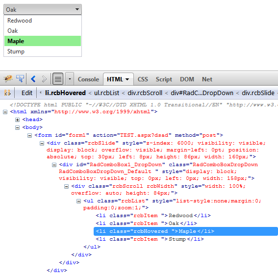

# Understanding the Skin CSS File


## 

Styles for RadControls are defined using Cascading Style Sheet (CSS) syntax. Each style consists of a selector that identifies an HTML element to be styled, and property / value pairs that describe each of the style specifics, e.g. color, padding, margins, etc. For example, the ".rcbHovered" style will have a light green background and bold font-weight.

````ASPNET
.RadComboBoxDropDown_Default .rcbList .rcbHovered
{
	background: LightGreen;
	font-weight: bold ;
}
````


See the [CSS Skin File Selectors]() topic for more information on the specific CSS selectors used for RadComboBox skins. You can see the applied custom styles in the screenshot below.

>tip The styled RadCombBox is running in a [FireFox](http://www.mozilla.com/en-US/firefox/) browser and using the [Firebug](http://www.getfirebug.com) plug-in to help visualize the HTML on-the-fly. You can install and use the Firebug plug-in to audition changes to the CSS file and see the results instantly.
>


Each style maps to a "class" attribute in an HTML tag. For example, the RadComboBoxDropDown_Default is a class name by which the entire `<div>` tag representing the drop-down list of the control, is styled. Class attributes change as the property values for the control change. For example, the third item in the list "Maple" has the mouse hovered over it and it is styled using the class attribute "rcbHovered".


