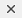

# RadComboBox Item Builder

The **RadComboBox Item Editor** lets you define items **inline** (in the aspx page).

## RadComboBox Item Editor

There are two ways to bring up the RadComboBox Item Editor:

* From the **RadComboBox** [ Smart Tag ](), click on the **Build RadComboBox** link.

* Right-click on the **RadComboBox** control and select **Build RadComboBox** from its pop-up menu.

You can add, edit, delete and re-arrange items:

|  **Button**  |  **Description**  |
| ------ | ------ |
||Click the Add button to append a ComboBoxItem to the list.|
||Use the up and down arrow buttons to rearrange the items in the list. This order determines the order the items appear in the drop-down list.|
||Select an item and click the Delete button to delete it from the list.|
||Select individual items to change their properties using the property pane on the right of the **RadComboBox Item Editor** . Use the sorting controls above the property paneto sort the properties by category or alphabetically.|

## RadComboBoxItem Properties

For each **RadComboBoxItem**,

* **Text** is the string that the user sees for the item in the drop-down list.

* **ToolTip** is a string that appears in the tooltip window when the user hovers the mouse over the item in the drop-down list.

>note Setting the tooltip can enable an accessibility feature: Special accessibility readers like JAWS can pronounce the tooltip of the highlighted item.
>

* **Value** is the value associated with the item. It determines the value of the combobox's **SelectedValue** property when the item is selected. By default it is equal to the **Text** of the item.

* **Selected** lets you control which item is initially selected when the **RadComboBox** first appears.

>note Only one item can be selected at a time. If you set **Selected** to **True** for an item, the **Selected** property of all other items is automatically set to **False** .
>

* **Enabled** determines whether the user can select the item from the drop-down list.

* **CssClass** is the name of a CSS style to be applied to the combobox item. The style can be declared in the CSS file of the applied [skin]().

>tip You can also customize the appearance of items using[templates]().
>

# See Also

 * [Overview]()
