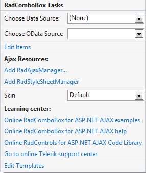
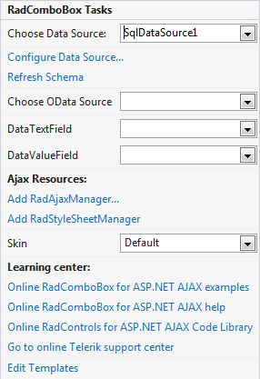

# Smart Tag

The __RadComboBox__ Smart Tag allows easy access to frequently needed tasks. You can display the __Smart Tag__ by right clicking on a __RadComboBox__ control in the design window, and choosing __Show Smart Tag__.

## Unbound Smart Tag

When __RadComboBox__is unbound, the Smart Tag looks like the following:

Using the unbound __RadComboBox__Smart Tag you can perform the following:

## RadComboBox Tasks

* __Choose Data Source__ lets you bind the RadComboBox declaratively by selecting a data source from a drop-down list of all available data source components. If you select __<New Data Source...>__ the standard Windows [Data Source Configuration Wizard](http://msdn2.microsoft.com/en-us/library/ms247282(VS.80).aspx) appears, where you can create and configure a data source component.

* __Build RadComboBox__ opens the [RadComboBox Item builder](), where you can add static items to the RadComboBox and set their properties.

* __Skin__ lets you select from a list of available [skins]() to customize the look of your __RadComboBox__.

## Learning Center

Links navigate directly to RadComboBox examples, help, or code library. You can also search the Telerik web site for a given string.

## Edit Templates

Clicking the __Edit Templates__ link brings up a [template editor]() where you can customize the Item Template.

## Bound Smart Tag

When __RadComboBox__is bound to a data source, the Smart Tag looks like the following:

Using the bound __RadComboBox__Smart Tag you can perform any task you can perform with the unbound Smart Tag. In addition, you can choose __Configure Data Source...__ to open the standard Windows [Data Source Configuration Wizard](http://msdn2.microsoft.com/en-us/library/ms247282(VS.80).aspx), where you can configure the currently bound data source component.

Once the Data Source is chosen, you can select each of the following: __DataTextField__and __DataValueField__. These should be fields in the Data Source which will serve data respectively for the __Text__ and __Value__ properties of RadComboBox Items.

# See Also

 * [Overview]()
