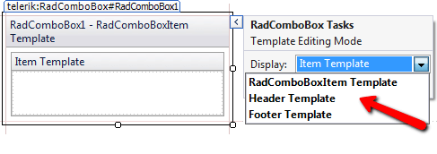
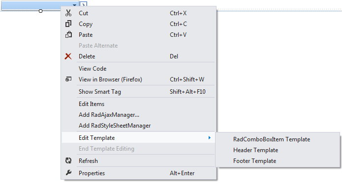

# Template Design Surface

## 

The **Template Design Surface** lets you design templates for the items, header template and footer template of the RadComboBox. There are two ways to display the Template Design Surface:

* From the RadComboBox's Smart Tag, choose **Edit Templates.** A Pop-up appears, along with the Template Design Surface. 

* Right-click RadComboBox's instance, and from the context menu, select **Edit Template** and choose which template to edit. The **Template Design surface** appears.

On the design surface, you can drag any controls from the Toolbox, as well as typing any literal text. By moving to Source view, you can add other HTML content to the template and set attributes to display the item's value.

When you have finished designing your template, choose **End Template Editing** from the RadComboBox's context menu or Smart Tag pop-up.

# See Also

 * [Adding Templates]()

 * [Overview]()
