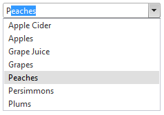
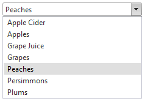
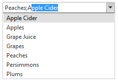

# Autocomplete


**RadComboBox** supports client-side autocomplete - end users can autocomplete RadComboBox's items. As soon as the user types some text in the input area, the text is automatically completed to the first matching item. To enable the autocomplete mechanism of RadComboBox, set the **MarkFirstMatch** property to **True**.

In addition, you can define an **AutoCompleteSeparator** to allow the users to select several items and separate them using this predefined separator.

As of Q2 2008, **RadComboBox** introduces a new property - **EnableTextSelection.** It can have two values:

* **True** (default) - when the user types in the input area, RadComboBox automatically completes the string to the first matching item in the list, **highlighting** the text that was not entered by the user.

* **False** - when the user types in the input area, RadComboBox automatically completes the string to the first matching item in the list - it **does not highlight** the text and places the cursor after the matched text.

>note  **EnableTextSelection** property works only when MarkFirstMatch is set to True.
>


## Autocomplete with a multi-columned RadComboBox

If RadComboBox displays [multiple columns](), you can search by whichever column value you want, by formatting the text of items so that the desired search column comes first. Use the ItemDataBound event handler to set the text of the items in the desired order:


````C#
	     
protected void RadComboBox1_ItemDataBound(object sender, RadComboBoxItemEventArgs e)
{  
 e.Item.Text = ((DataRowView)e.Item.DataItem)["CompanyName"].ToString() + "; " +                
			   ((DataRowView)  e.Item.DataItem)["City"].ToString() + "; " +                
			   ((DataRowView)e.Item.DataItem)["ContactTitle"].ToString();
}
				
````
````VB.NET
	     
Protected Sub RadComboBox1_ItemDataBound(ByVal sender As Object, ByVal e As RadComboBoxItemEventArgs)
	e.Item.Text = (DirectCast(e.Item.DataItem, DataRowView))("CompanyName").ToString() + "; " +
				  (DirectCast(e.Item.DataItem, DataRowView))("City").ToString() + "; " +
				  (DirectCast(e.Item.DataItem, DataRowView))("ContactTitle").ToString()
End Sub
	
````


## Autocomplete without a separator

The following example shows the use of autocomplete without a separator. The **MarkFirstMatch** property is set to **True**:

````ASPNET
<telerik:radcombobox 
	id="RadComboBox1"
	runat="server"
	markfirstmatch="True"> 
	<Items>   
		<telerik:RadComboBoxItem runat="server" Text="Apple Cider" />   
		<telerik:RadComboBoxItem runat="server" Text="Apples" />   
		<telerik:RadComboBoxItem runat="server" Text="Grape Juice" />   
		<telerik:RadComboBoxItem runat="server" Text="Grapes" />   
		<telerik:RadComboBoxItem runat="server" Text="Peaches" />   
		<telerik:RadComboBoxItem runat="server" Text="Persimmons" />   
		<telerik:RadComboBoxItem runat="server" Text="Plums" /> 
	</Items>
</telerik:radcombobox>
````


When the user types in the input area (in this case, "P"), RadComboBox automatically completes the string to the first matching item in the list, highlighting the text that was not entered by the user:


|  **EnableTextSelection** is set to True. |  **EnableTextSelection** is set to False. |
| ------ | ------ |
|||

## Autocomplete using a separator character

By setting the **AutoCompleteSeparator** property, the previous example can be expanded to allow the input area to autocomplete the selection of several items:

````ASPNET
<telerik:radcombobox 
	id="RadComboBox" 
	runat="server" 
	markfirstmatch="True" 
	autocompleteseparator=";"
	width="269px"> 
	<Items>   
		<telerik:RadComboBoxItem runat="server" Text="Apple Cider" />   
		<telerik:RadComboBoxItem runat="server" Text="Apples" />   
		<telerik:RadComboBoxItem runat="server" Text="Grape Juice" />   
		<telerik:RadComboBoxItem runat="server" Text="Grapes" />   
		<telerik:RadComboBoxItem runat="server" Text="Peaches" />   
		<telerik:RadComboBoxItem runat="server" Text="Persimmons" />   
		<telerik:RadComboBoxItem runat="server" Text="Plums" /> 
	</Items>
</telerik:radcombobox>
````


Now, after selecting a first item, the user can enter the separator character. When the user types the next character, RadComboBox automatically completes the string to the first item that matches all characters after the separator character:



For a live example of the autocomplete feature, see [Autocomplete](https://demos.telerik.com/aspnet-ajax/ComboBox/Examples/Functionality/AutoCompleteClientSide/DefaultCS.aspx).

# See Also

 * [ItemDataBound]()
