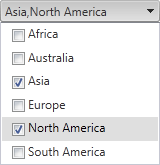

# CheckBox Support

As of **Q2 2011**, RadComboBox introduces simple CheckBox support. You can enable the CheckBox mode by setting the RadComboBox's **CheckBoxes** property to **true**.

When the CheckBox functionality is enabled, the behavior of the RadComboBox is different than the standard dropdown behavior—the **selection of items should be interpreted in terms of checking**. The user is now checking items instead of selecting.

This means that you need to use different events and API to work with checked items:

* The client-side events [OnClientItemChecking]() and [OnClientItemChecked]() should be handled instead of `OnClientSelectedIndexChanged` and `OnClientSelectedIndexChanging`. 

* The server-side [ItemChecked]() event must be used instead of `SelectedIndexChanged`.

* To get checked items on the client, use the  [get_checkedItems()]() method instead of `get_selectedItem()`.

* To get checked items on the server, use the **CheckedItems** property instead of `SelectedItem`.

* To control the checked state of an item on the client, use its `set_checked()` and `get_checked()` methods.

* To control the checked state of an item on the server, use its `Checked` property.

## Checkbox Support Related Properties

1. **Checked**—controls whether a particular **item** will be checked or not.

2. **CheckedItems**—a collection property, available both client and server side.

3. **EnableCheckAllItemsCheckBox**—when set to `true`, a `Check All` CheckBox appears in the drop-down above all the items. It enables check / uncheck-all functionality for the RadComboBox items.

	>tip The "Check All" CheckBox is not a RadComboBox item. It is a feature implemented entirely on the client and does a post-back to the server on checked / unchecked events only when the AutoPostBack property of the RadComboBox object is set to `true`.

4. **CheckedItemsTexts**—receives two predefined values:

	* **FitInInput** - default value. When this value is set and the text of the checked items exceeds the width of the input, it is replaced by `"X items checked"`.

	* **DisplayAllInInput**—the text of all checked items is displayed in the input of the RadComboBox.

5. **DataCheckedField**—The field name in the data source that defines the checked state of the RadComboBox items. It must be of type `boolean`.

## Checkbox Support Related Events

Client-side events:

* [OnClientItemChecking]()—occurs when a particular item is about to be checked. This event could be cancelled.

* [OnClientItemChecked]()—occurs when a particular item is checked.

Server-side events:

* [ItemChecked]()—occurs when a particular item is checked. In order for this event to be fired, **AutoPostBack** property should be set to **True**.

## User Experience

The text of the checked items is shown in the input of the RadComboBox, separated by commas. When the text exceeds the width of the input, it is replaced by **"X items checked"** where X denotes the number of items being checked, unless the **CheckedItemsTexts** property is set to **DisplayAllInInput**. When all of the items are checked, **"All items checked"** message appears in the input.

In order to access the checked items on the client-side use the [get_checkedItems()]() method of the RadComboBox's client-side object.

When working with the RadComboBox on the server-side note that the **SelectedValue** property is empty, because there is no single selected item. If you want to access the values of the checked items the aforementioned **CheckedItems** property should be used.

The newly added messages as "All items checked", "X items checked" and "Check All" could be localized.

## Limitations

There are a few scenarios that are not supported when CheckBox support is enabled:

*  The **MarkFirstMatch** and **Filter** features are not supported. The reason is that the CheckBox selection is different from the standard RadComboBox selection—there is no single selected item.

*  **Load On Demand** is not supported. The reason is that RadComboBox items loaded on demand are not accessible on the server which is needed for the CheckBox feature. A possible approach to overcome this limitation is replacing the RadComboBox with a [Kendo UI MultiSelect](https://www.telerik.com/kendo-ui/multiselect) widget with enabled Virtualization as demonstrated in the [MultiSelect/Virtualization](https://demos.telerik.com/kendo-ui/multiselect/virtualization) online demo.

# See Also

 * [Checkboxes Demo](http://demos.telerik.com/aspnet-ajax/combobox/examples/functionality/checkboxes/defaultcs.aspx)

 * [Configurator Demo](http://demos.telerik.com/aspnet-ajax/combobox/examples/configurator/defaultcs.aspx)
