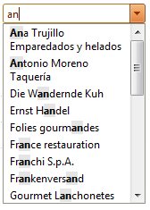
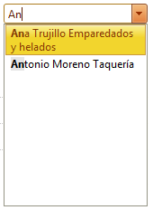
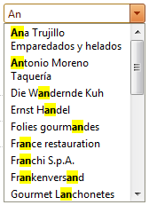

# Filtering


The filtering functionality is enabled through the **Filter** property. The following values could be assigned:

* **None** - this is the default value. No filtering is performed.

* **Contains** - returns all items which Texts' values contain the searched text as a substring:



* **StartsWith** - returns all items which texts start with the searched text:



>note 
* Filtering is NOT case sensitive;
*  **CheckBox** functionality is NOT supported in combination with filtering. The reason is that the CheckBox selection is different from thestandard RadComboBox's selection - there is no single selected item.
>


## Setting the Filter server-side


````C#
	
protected void Page_Load(object sender, EventArgs e) 
{ 
	RadComboBox1.Filter = RadComboBoxFilter.StartsWith; 
}
	
````
````VB.NET
		
Protected Sub Page_Load(ByVal sender As Object, ByVal e As EventArgs)

	RadComboBox1.Filter = RadComboBoxFilter.StartsWith

End Sub
	
````


## Setting the Filter inline

````ASPNET
<telerik:radcombobox id="RadComboBox1" filter="Contains" runat="server"></telerik:radcombobox>
````


## Controlling the appearance of the Filter

To control the appearance of the filtered items (their **`<EM>`** elements), the following CSS classes should be altered:

````ASPNET
<style type="text/css">
	div.RadComboBoxDropDown_Sunset em
	{
		font-style: normal;
		font-weight: bold;
	}
	div.RadComboBoxDropDown_Sunset .rcbItem em
	{
		background: Yellow;
	}
</style>
````


>note Sunset is the name of the Skin that the RadComboBox is currently using. You need to change it with the name of the skin that you use.
>


The result is:



>tip If you use **ItemsTemplate** the filtering will still work, but the matching text portion will not be highlighted (the **`<EM>`** element will be not added).
>


## How does the filtering work?

When you enable filtering (by setting the **Filter** property to either **Contains** or **StartsWith**) and you start typing in the input area of the combobox, the items that do not match are hidden by the client-side function **set_visible(false)**. They are visually invisible, but they do persist on the server. The items that do match the search text have **`<EM>`** element added within their text.
