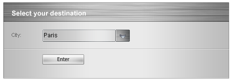

# Validation


>note The built-in ASP.NET validation can be used to validate the **RadComboBox** control.
>


To validate the content of RadComboBox, you just need to specify its **ID** in the **ControlToValidate** property of the validator. Validation is performed against the current **Text** property of the RadComboBox (the **Text** property of the currently selected item or the custom text entered in the RadComboBox' input field).

>note RadComboBox is validated by the **Text** property set to the items as these items not always have Values.
>


## Validating the RadComboBox

### Using ASP.NET Compare Validator

Compares the RadComboBox's text with the specified text in the CompareValidator's definition, using relations like less than, equal, not equal, etc.

````ASPNET
.validationClass
{
	color: Red;
}   
  
<telerik:RadComboBox ID="RadComboBox1" runat="server">
	<Items>
		<telerik:RadComboBoxItem Text=" - Select a City - " Value="SelectCity" />
		<telerik:RadComboBoxItem Text="Paris" Value="Paris" />
		<telerik:RadComboBoxItem Text="Rome" Value="Rome" />
		<telerik:RadComboBoxItem Text="London" Value="London" />
	</Items>
</telerik:RadComboBox>
<asp:CompareValidator runat="server" ID="Comparevalidator1" ValueToCompare=" - Select a City - "
	Operator="NotEqual" ControlToValidate="RadComboBox1" ErrorMessage="You must select a city!"
	CssClass="validationClass" />
			
````


When the combobox text is "- Select a City -", the validator detects an error and displays the message "You must select a city!":


When the combobox text is set to a city, the validator accepts the selection:



### Using ASP.NET Required Field Validator

Validates to make sure the user entered a value.

````ASPNET
	
<telerik:RadComboBox runat="server" ID="RadComboBox1">
	<Items>
		<telerik:RadComboBoxItem Text="" Value="EmptyItem" />
		<telerik:RadComboBoxItem Text="Paris" Value="Paris" />
		<telerik:RadComboBoxItem Text="Rome" Value="Rome" />
		<telerik:RadComboBoxItem Text="London" Value="London" />
	</Items>
</telerik:RadComboBox>
<asp:Button Text="Validate" runat="server" />
<asp:RequiredFieldValidator runat="server" ID="RequiredFieldValidator3" ControlToValidate="RadComboBox1"
	Display="Dynamic" ErrorMessage="You must select a city!" CssClass="validationClass"/>
	
````


### Using ASP.NET Custom Validator

Validates the RadComboBox's text against custom validation logic that you, the developer, provide.

````ASPNET
	
	
function validationFunction(source, args)
{
	if (args.Value == " - Select a City - ")
	{
		args.IsValid = false;
	} else
	{
		args.IsValid = true;
	}
}

<telerik:RadComboBox runat="server" ID="RadComboBox1" >
	<Items>
		<telerik:RadComboBoxItem Text=" - Select a City - " Value="SelectCity" />			
		<telerik:RadComboBoxItem Text="Paris" Value="Paris" />
		<telerik:RadComboBoxItem Text="Rome" Value="Rome" />
		<telerik:RadComboBoxItem Text="London" Value="London" />
	</Items>
</telerik:RadComboBox>
<asp:Button Text="Validate" runat="server" />
<asp:CustomValidator ErrorMessage='You must select a city!' ControlToValidate="RadComboBox1"
	ValidateEmptyText="true" runat="server" ClientValidationFunction="validationFunction"
	CssClass="validationClass" />
````


## Causing Validation

The RadComboBox can trigger validation of other controls on the form when it performs a post-back to the server. To achieve this behavior, you need to set the **CausesValidation** property to **True**.

By default, all validators on the web page must be successful before a postback can occur. You can limit the controls that must be validated when the RadComboBox performs a post-back, while still allowing other controls on the web page to be validated, by using **Validation Groups**. The validator controls including RadComboBox, have a **ValidationGroup** property. The RadComboBox validation is activated only by those validators whose **ValidationGroup** property matches the **ValidationGroup** property of the RadComboBox.

When no **ValidationGroup** is specified, all validators will execute when a post-back to the server is made. The reason of this beahvior is that both the validators and the RadComboBox have an empty string set as a default value of the **ValidationGroup** property.

````ASPNET
	     
<div>
	<asp:Label runat="server" Text="Enter your name:" AssociatedControlID="textBox1" />
	<asp:TextBox runat="server" ID="textBox1"></asp:TextBox>
	<asp:RequiredFieldValidator runat="server" ID="RequiredFieldValidator1" ControlToValidate="textBox1"
		CssClass="customValidatorClass" Display="Dynamic" ErrorMessage="You must enter you name!"
		ValidationGroup="TextBoxValidationGroup" />
</div>
<div>
	<asp:Label runat="server" Text="Enter your destination:" AssociatedControlID="RadComboBox1" />
	<telerik:RadComboBox ID="RadComboBox1" runat="server" Skin="Default" CausesValidation="True"
		ValidationGroup="ComboBoxValidationGroup">
		<Items>
			<telerik:RadComboBoxItem Text="" Value="" />
			<telerik:RadComboBoxItem Text="Paris" Value="Paris" />
			<telerik:RadComboBoxItem Text="Rome" Value="Rome" />
			<telerik:RadComboBoxItem Text="London" Value="London" />
		</Items>
	</telerik:RadComboBox>
	<asp:RequiredFieldValidator runat="server" ID="RequiredFieldValidator2" ControlToValidate="RadComboBox1"
		CssClass="validationClass" Display="Dynamic" ErrorMessage="You must select a city!"
		ValidationGroup="ComboBoxValidationGroup" />
	<div>
		<!--When Search button is clicked, only validation controls that are a part of the 
specified ValidationGroup are validated.-->
		<asp:Button ID="Button1" runat="server" Text="Validate" ValidationGroup="TextBoxValidationGroup" />
	</div>
</div>
				
````


For a live example, see [Validation Groups](http://demos.telerik.com/aspnet-ajax/ComboBox/Examples/Functionality/ValidationGroup/DefaultCS.aspx).
