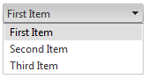

# Getting Started

This tutorial will walk you through creating a __RadComboBox__ and shows how to:

* Create a simple RadComboBox with elements set in design time.

* Populate RadComboBox from a data source.

## Creating a Simple RadComboBox

1. Drag a RadComboBox from the Toolbox onto your Web Page.

1. The [Smart Tag]() should appear automatically. From the Smart Tag, choose __Build RadComboBox...__
>caption 

1. The __[RadComboBox Item Builder]()__ appears.

1. Click the __Add item__ icon in the upper left corner. A new __RadComboBoxItem__ appears in the item builder.
>caption 

1. Set the __Text__ property to "First Item".

1. Add two more items in the same way.

1. Press __OK__ to exit the __RadComboBox Item Builder__.

1. Back in the Smart Tag, choose a __[Skin]()__ from the drop-down control.
>caption 

1. Right-click the __RadComboBox__ instance and select __Properties__.
>caption 

1. In the properties pane for the RadComboBox, Set the __Height__ property to 150.

1. Run the application. Open the drop-down list to see the items.
>caption 

## Binding to an AccessDataSource

1. In order to [bind the RadComboBox to an AccessDataSource](), you must first have a DataSource component on your page. Drag an __AccessDataSource__ component from the Toolbox onto the same page where your RadComboBox is.
>caption 

1. From the Smart Tag of the AccessDataSource, choose __Configure DataSource.__
>caption 

1. Click the Browse button, locate, and select the AccessData File and press __Next__ to continue.
>caption 

1. Specify the columns from a table and press __Next__ to continue.
>caption 

1. You may choose to test your Query to preview the data. Finally, press Finish to exit.
>caption 

1. On the __RadComboBox__ Smart Tag, choose the AccessDataSource from the drop-down list labelled __Choose Data Source__.
>caption 

1. In the properties pane for RadComboBox, set the __DataTextField__ and __DataValueField__.
>caption 

1. Run the application. The data from your table now appears in the RadComboBox.
>caption 

