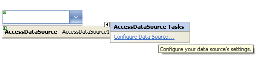

# Getting Started

This tutorial will walk you through creating a **RadComboBox** and shows how to:

* Create a simple RadComboBox with elements set in design time.

* Populate RadComboBox from a data source.

## Creating a Simple RadComboBox

* Drag a RadComboBox from the Toolbox onto your Web Page.

* The [Smart Tag]() should appear automatically. From the Smart Tag, choose **Build RadComboBox...**

* The **[RadComboBox Item Builder]()** appears.

* Click the **Add item** icon in the upper left corner. A new **RadComboBoxItem** appears in the item builder.

* Set the **Text** property to "First Item".

* Add two more items in the same way.

* Press **OK** to exit the **RadComboBox Item Builder**.

* Back in the Smart Tag, choose a **[Skin]()** from the drop-down control.

* Right-click the **RadComboBox** instance and select **Properties**.

* In the properties pane for the RadComboBox, Set the **Height** property to 150.

* Run the application. Open the drop-down list to see the items.

## Binding to an AccessDataSource

* In order to [bind the RadComboBox to an AccessDataSource](), you must first have a DataSource component on your page. Drag an **AccessDataSource** component from the Toolbox onto the same page where your RadComboBox is.

* From the Smart Tag of the AccessDataSource, choose **Configure DataSource.**

* Click the Browse button, locate, and select the AccessData File and press **Next** to continue.

* Specify the columns from a table and press **Next** to continue.

* You may choose to test your Query to preview the data. Finally, press Finish to exit.

* On the **RadComboBox** Smart Tag, choose the AccessDataSource from the drop-down list labelled **Choose Data Source**.

* In the properties pane for RadComboBox, set the **DataTextField** and **DataValueField**.

* Run the application. The data from your table now appears in the RadComboBox.

