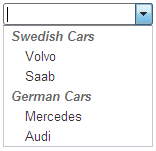

# Grouping Items


## 

The standard **`<SELECT>`** element has a **`<optgroup>`** tag used to group together related options.

This article shows how make **RadComboBox** look and feel the same way.

1. Use the [IsSeparator]() property to make the appropriate items not clickable:

````ASPNET
<telerik:RadComboBox ID="RadComboBox1"
   runat="server"
   Skin="Vista"
   Width="150px"
   AllowCustomText="true">
   <Items>
	   <telerik:RadComboBoxItem runat="server" IsSeparator="True" Text="Swedish Cars"/>
	   <telerik:RadComboBoxItem runat="server" Text="Volvo" />
	   <telerik:RadComboBoxItem runat="server" Text="Saab" />
	   <telerik:RadComboBoxItem runat="server" IsSeparator="True" Text="German Cars" />
	   <telerik:RadComboBoxItem runat="server" Text="Mercedes" />
	   <telerik:RadComboBoxItem runat="server" Text="Audi" />
   </Items>
</telerik:RadComboBox> 
````


2. Add the following CSS rules to the `<HEAD>` section of your page to achieve the desired look:

````ASPNET
<style type="text/css">
	div.RadComboBoxDropDown_Vista .rcbSeparator
	{
		background: none;
		font-family: Arial;
		font-weight: bold;
		font-style: italic;
		font-size: 10pt;
		padding-left: 6px !important;
	}
	div.RadComboBoxDropDown_Vista .rcbItem, div.RadComboBoxDropDown_Vista .rcbHovered
	{
		padding-left: 20px;
		font-family: Arial;
		font-size: 10pt;
	}
</style>
````


If you are using a skin different from Vista, just replace "Vista" with the name of your skin.

Here is the result:


