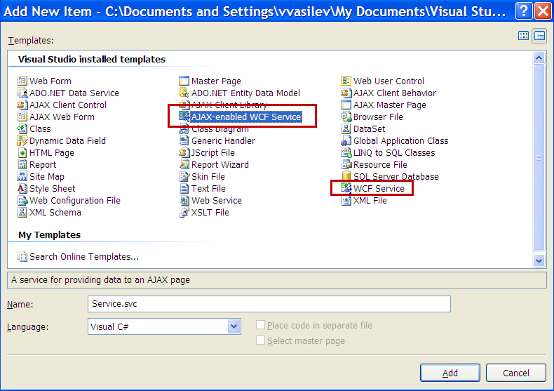

# Loading Items from WCF Service


## 

As of Q1 2009, RadComboBox supports load-on-demand from **WCF service**.

The steps below show how to load items from WCF service. It shows how to use the **context** object to pass information from the client to the OperationContract. We will set additional **Attributes** for every item (in addition to **Text** and **Value** properties) so we can see how to use them in the [OnClientItemDataBound]() event.


1. Create a new Web Site in Visual Studio 2008. Make sure the target framework is set to 3.5.

2. Drag RadComboBox from your Toolbox. From the SmartTag click on the Add RadScriptManager link. It will automatically register the handler in the web.config file.

	

	


3. Add the WCF service – right click on your project in the Solution Explorer and select Add New Item. This is **important**: select the **Ajax-enabled WCF service** option (do not mix it with WCF Service).

	


Clicking the Add button will create the .svc file as well as the code behind file placed in the App_Code folder. The web.config file is also automatically updated with the appropriate system.serviceModel node.

````XML
<system.serviceModel>
   <behaviors>
	 <endpointBehaviors>
	   <behavior name="ServiceAspNetAjaxBehavior">
		 <enableWebScript />
	   </behavior>
	 </endpointBehaviors>
   </behaviors>
   <serviceHostingEnvironment aspNetCompatibilityEnabled="true" />
   <services>
	 <service name="Service">
	   <endpoint address="" behaviorConfiguration="ServiceAspNetAjaxBehavior" binding="webHttpBinding" contract="Service" />
	 </service>
   </services>
</system.serviceModel> 
````


>note These settings are important. If you don't set them correctly - you might receive the following JavaScript error:
> **Method "MethodName" Failed.** 
>


4. Open the Service.cs file and add the method which will return the RadComboBox items.

````C#
	     
	
[ServiceContract(Namespace = "")]
[AspNetCompatibilityRequirements(RequirementsMode = AspNetCompatibilityRequirementsMode.Allowed)]
	
	public class Service{    
	[OperationContract]    
	public RadComboBoxData GetData(RadComboBoxContext context)    
	{        
		RadComboBoxData result = new RadComboBoxData();        
		List<RadComboBoxItemData> items = new List<RadComboBoxItemData>();        
		string productsSuite = context["ProductSuite"].ToString();        
		List<String> radControls = new List<string>()                                    
		{                                       
			"RadComboBox", "RadMenu", "RadTreeView", "RadToolBar" 
		};
		foreach (string radControl in radControls)        
		{            
			RadComboBoxItemData item = new RadComboBoxItemData()                        
			{                            
				Text = string.Format("{0} for {1}", radControl, productsSuite), Value = radControl,                           
				//set the attribute of the item which will be used in the ClientDataBound event                            
				Attributes = new Dictionary<string, object>{{"ImageUrl", radControl + ".gif"}}                        
			};            
			
			items.Add(item);        
		}
		result.Items = items.ToArray();
		return result;    
	}
} 
				
````


Note that the above code uses the context object which passes the information of the selected RadioButton on the page and is set in the [OnClientItemsRequesting]() event.

We want to set the **ImageUrl** property of the item, but it is not available in the RadComboBoxItemData class. That is why we set an attribute "ImageUrl" of the item and then get that attribute in the [OnClientItemDataBound]() event:

````JavaScript
	     
	
function onClientRequesting(sender, e) 
{        
	var context = e.get_context();        
	//using jQuery to get the checked item and pass it to the server        
	context["ProductSuite"] = $telerik.$("input[name='rblSuites']:checked").val();    
}

function onClientDataBound(sender, e) 
{        
	var item = e.get_item();
	//setting the imageUrl property of the item based on its attribute
	var imageUrl = "Images/" + item.get_attributes().getAttribute("ImageUrl");
	item.set_imageUrl(imageUrl);    
}  
				
````


RadComboBox declaration:

````ASPNET
<asp:RadioButtonList ID="rblSuites" runat="server">
	<asp:ListItem Selected="True">ASP.NET AJAX</asp:ListItem>
	<asp:ListItem>WPF</asp:ListItem>
	<asp:ListItem>Silverlight</asp:ListItem>
	<asp:ListItem>Winforms</asp:ListItem>
</asp:RadioButtonList>
<telerik:radcombobox 
	id="RadComboBox1" 
	enableloadondemand="true" 
	width="250" 
	onclientitemdatabound="onClientDataBound"
	onclientitemsrequesting="onClientRequesting" 
	runat="server">
	<WebServiceSettings Method="GetData" Path="Service.svc" />          
</telerik:radcombobox>
````


Result:


# See Also

 * [Online Demo - ComboBox / WCF Web Service.](http://demos.telerik.com/aspnet-ajax/combobox/examples/loadondemand/wcf/defaultcs.aspx)

 * [Blog post with working project.](http://blogs.telerik.com/veselinvasilev/posts/09-04-08/how-to-use-wcf-services-with-asp-net-ajax-databound-controls.aspx)
