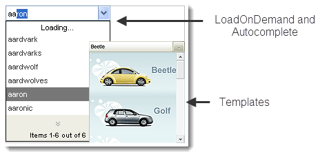

# ComboBox Overview

**Telerik RadComboBox for ASP.NET AJAX** is a flexible drop-down control for ASP.NET applications. 

#### Key Features

**RadComboBox** introduces a number of advanced features, including:

* [A client-side API]() that includes the ability to add, delete and update RadComboBox items and allow the changes to persist server-side.

* Flexible binding mechanism, including:

	* [declarative binding]()

	* [binding to different types of data source components]()

	* [populating from XML]()

	* [populating items through a WebService]().

* [Load-on-demand]() support for faster performance when the combobox has many items.

* Powerful [auto-complete]() functionality with multi-item auto-complete.

* Fast client-side [filtering]().

* [Sorting]() of items.

* Support for [column headers and multiple columns]().

* [End-user restriction]() policies.

* [Customizable appearance]() through [skins](). RadComboBox can be styled to a detailed level including the drop-down list elements, drop down button, and text entry areas.

* [Customizable items](), including the ability to assign tooltips to items and apply CSS styles to individual items.

* [Content template support]().

* Support for [custom attributes]().

* [Animation]() for the appearance of the drop-down list.

* Support for [right-to-left]() locales.

* Integration with ASP.NET [validation support]().

* [Keyboard support]() for easy navigation.

* [Server-side events]() for customizing behavior.

* **Overlay support**. RadComboBox can display its drop-down list over IE windowed objects suchHTML select boxes, Flash movies, and so on. This built-in feature does not need to be set explicitly through a property.

* **Screen boundary detection**.The drop-down expands to the opposite direction when necessary to prevent screen boundaries from being crossed.

* [Cross-page postbacks](), which let you direct postbacks from the combobox to a different Web page.

* [Simple rendering]() saves HTML output.

* Support for all major browsers, including Internet Explorer 5.0 and above, Netscape 6.0 and above (PC and Mac), Mozilla 0.6 and above (PC and Mac),Firefox 0.9 and above (PC and Mac), Opera 7 and above, and Safari 1.2 and above.

