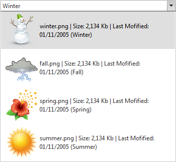

# Custom Attributes


**RadComboBox** items provide a special collection called **Attributes**. You can use this collection to expand the information stored with the items. The **Attributes** collection lets you store any number of attributes as name / value pairs. You can specify custom attributes declaratively in the **RadComboBoxItem** tag or programmatically using the **Attributes** collection of the RadComboBoxItem. You can also access custom attributes client-side, using the **get_attributes** collection of the **RadComboBoxItem** client-side object.

## Using attributes declaratively

This example shows how to use custom attributes declaratively to display extra information in RadComboBox items:



To customize RadComboBox items, this example uses an item [template](). The custom attributes of the item are used to bind the controls in the template. The template controls are bound using data-binding expressions with typical ASP.NET format and syntax, e.g. "**<%# DataBinder.Eval(Container, "Attributes['ImagePath']") %>".** Both **ImagePath** and **DisplayName** are custom attributes.

````C#
<telerik:radcombobox id="RadComboBox1" markfirstmatch="True" runat="server" height="297px"
	width="350px" skin="Default" autopostback="False" highlighttemplateditems="True"
	showtoggleimage="True">
<ItemTemplate>
	<table >
		<tr>
			<td>
				' alt="" />
			</td>
			<td>
				<%# DataBinder.Eval(Container, "Attributes['DisplayName']") %>
				(<%# DataBinder.Eval(Container, "Text") %>)
			</td>
		</tr>
	</table>
</ItemTemplate>
<Items>
	<telerik:RadComboBoxItem ImagePath="winter.png" DisplayName="winter.png | Size: 2,134 Kb | Last Mofified: 01/11/2005"
		Text="Winter"></telerik:RadComboBoxItem>
	<telerik:RadComboBoxItem ImagePath="fall.png" DisplayName="fall.png | Size: 2,134 Kb | Last Mofified: 01/11/2005"
		Text="Fall"></telerik:RadComboBoxItem>
	<telerik:RadComboBoxItem ImagePath="spring.png" DisplayName="spring.png | Size: 2,134 Kb | Last Mofified: 01/11/2005"
		Text="Spring"></telerik:RadComboBoxItem>
	<telerik:RadComboBoxItem ImagePath="summer.png" DisplayName="summer.png | Size: 2,134 Kb | Last Mofified: 01/11/2005"
		Text="Summer"></telerik:RadComboBoxItem>
</Items>
</telerik:radcombobox>
````


Before the template can use the custom attributes in its data-binding expressions, the application needs to explicitly bind the items by calling the **DataBind** method of the **RadComboBoxItem** objects:


````C#
	     
protected void Page_Load(object sender, EventArgs e)
{   
	for (int i = 0; i < RadComboBox1.Items.Count; i++)   
	{      
		RadComboBox1.Items[i].DataBind();   
	}      
}
				
````
````VB.NET
	     
Protected Sub Page_Load(ByVal sender As Object, ByVal e As EventArgs) Handles Me.Load
	Dim i As Integer = 0
	While i < RadComboBox1.Items.Count
		RadComboBox1.Items(i).DataBind()
		i = i + 1
	End While
End Sub
	
````


## Using custom attributes server-side

## Creating items programmatically

You can add any name/value pair (value must be string) in the Attributes collection of each RadComboBoxItem and retrieve it later.


````C#
	
...
RadComboBoxItem item = new RadComboBoxItem("Some Item");
item.Attributes["ImagePath"] = "fall.png";
item.Attributes["DisplayName"] = "fall.png | Size: 2,134 Kb | Last Mofified: 01/11/2005";
...
	          
````
````VB.NET
	
...
Dim item As New RadComboBoxItem("Some Item")
item.Attributes("ImagePath") = "fall.png"
item.Attributes("DisplayName") = "fall.png | Size: 2,134 Kb | Last Mofified: 01/11/2005"s
...
	
````


## RadComboBox data binding

You can handle the RadComboBox' **ItemDataBound** event and set the Attributes for each Item there.


````C#
	     
	
protected void RadComboBox1_ItemDataBound(object sender, RadComboBoxItemEventArgs e)
{    
	DataRowView dataItem = (DataRowView)e.Item.DataItem;
	e.Item.Attributes["ImagePath"] = dataItem["ImagePath"];    
	e.Item.Attributes["Description"] = dataItem["Description"];
}
				
````
````VB.NET
	
	
Protected Sub RadComboBox1_ItemDataBound(ByVal sender As Object, ByVal e As RadComboBoxItemEventArgs) Handles RadComboBox1.ItemDataBound

	Dim dataItem As DataRowView = CType(e.Item.DataItem, DataRowView)
	e.Item.Attributes("ImagePath") = dataItem("ImagePath")
	e.Item.Attributes("Description") = dataItem("Description")

End Sub
	
````


## Using custom attributes client-side

Custom attributes are exposed in the client-side API as well. Each client-side instance of **RadComboBoxItem** has a collection named **Attributes** that contains all custom attributes for the respective item. This example demonstrates how to show some custom attributes for the selected item:

````C#
<telerik:radcombobox id="RadComboBox1" runat="server" onclientselectedindexchanging="ItemChanged" />
<script language="javascript">
	function ItemChanged(combo, eventArgs) {
		var item = eventArgs.get_item();
		alert(item.get_attributes().getAttribute("DisplayName"));
		alert(item.get_attributes().getAttribute("ImagePath"));
	}

</script>
````


# See Also

 * [Data Binding Overview]()

 * [ItemDataBound]()
