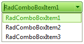

# Declaring the Items In-line


The definition of **RadComboBox** items can be added to the in-line declaration of RadComboBox using the [RadComboBox Item Builder](). The item builder updates the ASPX or ASCX file to include the list of items and their properties.

You can also directly edit the ASPX or ASCX file by adding items to the `<Items></Items>` section of the **RadComboBox** declaration. Every item definition must be enclosed in `<telerik:RadComboBoxItem>` and `</telerik:RadComboBoxItem>` tags.

## Examples

Add the following **inline** definition of RadComboBox to your ASPX or ASCX file:

````ASPNET
<telerik:radcombobox 
	id="RadComboBox1" 
	runat="server"
	skin="Hay"> 
	<Items>   
		<telerik:RadComboBoxItem runat="server" Text="RadComboBoxItem1" />   
		<telerik:RadComboBoxItem runat="server" Text="RadComboBoxItem2" />   
		<telerik:RadComboBoxItem runat="server" Text="RadComboBoxItem3" /> 
	</Items>
</telerik:radcombobox>
````


At run-time, the result will be:


