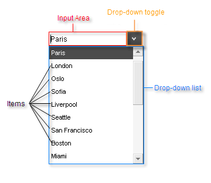

# RadComboBox Structure

## 

The structure of the **RadComboBox** control is as follows:

The top of the control has an Input Area, which displays the selected item. Depending on the **RadComboBox** properties, the user can use this area to type in a new value. Next to the input area is a drop-down toggle, which controls whether the Drop-down list is visible. The drop-down list contains a collection of items, from which the user can choose.
