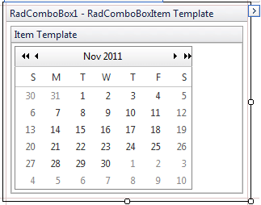
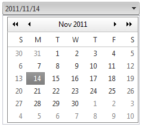
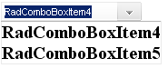

# Adding Templates


## Adding templates at design time

Templates could be added using the [Template Design Surface](). This provides a surface where you can visually design the template with dragging and dropping controls from the Toolbox.

The following example demonstrates how to use the Template Design Surface to add a **RadCalendar** control to the ItemTemplate.

* Drag a **RadComboBox** from the Toolbox onto your web page.

* From the Smart Tag that appears when you drop the **RadComboBox**, choose **Edit Templates**.

* The Template Design Surface appears, set for editing the **ItemTemplate**.

* Drag a **RadCalendar** control from the Toolbox onto the Template Design Surface.


* Right click on the **RadCalendar** control, choose **Properties** from its context menu, and set the following properties:

	* Set the **TitleFormat** property to "MMM yyyy".

	* Set the **ShowRowHeaders** property to **False**.

	* Set the **AutoPostBack** property to **True**.

	* Set the **EnableMultiSelect** property to **True**.

* Subscribe the **RadCalendar** control to its **SelectionChanged** event: 


````C#
	     
	
protected void RadCalendar1_SelectionChanged(object sender, 
	Telerik.Web.UI.Calendar.SelectedDatesEventArgs e)
{    
	RadCalendar calendar = (RadCalendar)RadComboBox1.SelectedItem.FindControl("RadCalendar1");    
	RadComboBox1.SelectedItem.Text = String.Format("{0}/{1}/{2}", calendar.SelectedDate.Year, calendar.SelectedDate.Month, calendar.SelectedDate.Day);
	RadComboBox1.OpenDropDownOnLoad = false;
}
				
````
````VB.NET
	     
	
Protected Sub RadCalendar1_SelectionChanged(
		ByVal sender As Object, 
		ByVal e As Telerik.Web.UI.Calendar.SelectedDatesEventArgs) 
		Handles RadCalendar1.SelectionChanged 
		Dim calendar As RadCalendar = DirectCast(RadComboBox1.SelectedItem.FindControl("RadCalendar1"), RadCalendar)
		RadComboBox1.SelectedItem.Text = [String].Format("{0}/{1}/{2}", calendar.SelectedDate.Year, calendar.SelectedDate.Month, 
	calendar.SelectedDate.Day)
		RadComboBox1.OpenDropDownOnLoad = False
End Sub
	
````

Note that the event handler finds the RadCalendar control within the RadComboBox's **SelectedItem** and uses that to set the text of the selected item.

* Use the Smart Tag anchor to display the Edit Templates pop-up, and choose **End Template Editing** to close the Template Design Surface.

* From the Smart Tag, choose **Build RadComboBox**. In the RadComboBox Item Builder, add a single item to the RadComboBox with no **Text** property. At this point, the declaration for RadComboBox should look as follows:

````ASPNET
<telerik:radcombobox id="RadComboBox1" runat="server">      
<ItemTemplate>      
	<telerik:RadCalendar RenderMode="Lightweight" 
		ID="RadCalendar1"
		runat="server" 
		TitleFormat="MMMM yyyy" 
		ShowRowHeaders="false" 
		OnSelectionChanged="FromDateChanged" 
		AutoPostBack="true"
		EnableMultiSelect="false">      
	</telerik:RadCalendar>   
</ItemTemplate>  
<Items>     
	<telerik:RadComboBoxItem />  
</Items>
</telerik:radcombobox>
````


* Run the application.When you click the RadComboBox's drop-down toggle, the RadCalendar appears. The RadCalendar selected date becomes the selected text in the RadComboBox:



## Adding templates at runtime

You can also add templates to **RadComboBox** at runtime, using the **ItemTemplate** and **HeaderTemplate** properties. These properties are of type **ITemplate**, so you must assign objects that implement that interface.

>note The RadComboBox items should be dynamically added so that templates can be defined at run time.
>Also, **items should be bound** so that DataBinder.Eval expressions may be used. In other words, you should call the **DataBind** method of the RadComboBox object or bind the items that are about to use **DataBinder.Eval** . You can bind a specific item by calling the **DataBind** method of this specific item.
>


>caution The **ItemTemplate** should be initialized in the **OnInit** event of the page. This is needed as the template should be instantiated before RadComboBox items are initialized.
>


````C#
	     	
protected override void OnInit(EventArgs e)
{    
	RadComboBox1.ItemTemplate = new LabelTemplate();    
	base.OnInit(e);
}
protected void Page_Load(object sender, EventArgs e)
{    
	if (!Page.IsPostBack)    
	{       
		RadComboBox1.Items.Add(new RadComboBoxItem("RadComboBoxItem4"));       
		RadComboBox1.Items.Add(new RadComboBoxItem("RadComboBoxItem5"));    
	}

	RadComboBox1.DataBind();
}
	
class LabelTemplate : ITemplate
{    
	public void InstantiateIn(Control container)    
	{        
		Label label1 = new Label();        
		label1.ID = "ItemLabel";        
		label1.Text = "Text";        
		label1.Font.Size = 15;        
		label1.Font.Bold = true;        
		label1.DataBinding += new EventHandler(label1_DataBinding);        
		container.Controls.Add(label1);     
	}

	private void label1_DataBinding(object sender, EventArgs e)     
	{         
		 Label target = (Label)sender;         
		 RadComboBoxItem item = (RadComboBoxItem)target.BindingContainer;         
		 string itemText = (string)DataBinder.Eval(item, "Text");         
		 target.Text = itemText;     
	}
}
				
````
````VB.NET
		
Protected Overloads Overrides Sub OnInit(ByVal e As EventArgs)
	RadComboBox1.ItemTemplate = New LabelTemplate()
	MyBase.OnInit(e)
End Sub

Protected Sub Page_Load(ByVal sender As Object, ByVal e As EventArgs)

	If Not Page.IsPostBack Then
		RadComboBox1.Items.Add(New RadComboBoxItem("RadComboBoxItem4"))
		RadComboBox1.Items.Add(New RadComboBoxItem("RadComboBoxItem5"))
	End If
	RadComboBox1.DataBind()
End Sub

Class LabelTemplate
	Implements ITemplate
	Public Sub InstantiateIn(ByVal container As Control) Implements ITemplate.InstantiateIn
		Dim label1 As Label = New Label
		label1.ID = "ItemLabel"
		label1.Text = "Text"
		label1.Font.Size = 15
		label1.Font.Bold = True
		AddHandler label1.DataBinding, AddressOf Me.label1_DataBinding
		container.Controls.Add(label1)
	End Sub
	Private Sub label1_DataBinding(ByVal sender As Object, ByVal e As EventArgs)
		Dim target As Label = CType(sender, Label)
		Dim item As RadComboBoxItem = CType(target.BindingContainer, RadComboBoxItem)
		Dim itemText As String = CType(DataBinder.Eval(item, "Text"), String)
		target.Text = itemText
	End Sub
End Class
	
````


An alternate method of defining a template in the OnInit event of the page, is to instantiate each item on postback. In the previous example, the LabelTemplate class initializes a label in the InstantiateIn method. In the next example, the InstantiateIn method is called for the LabelTemplate object for each item.


````C#
	     
	
protected void Page_Load(object sender, EventArgs e)
{            
	if (!Page.IsPostBack)    
	{        
		RadComboBox1.Items.Add(new RadComboBoxItem("RadComboBoxItem4"));        
		RadComboBox1.Items.Add(new RadComboBoxItem("RadComboBoxItem5"));    
	}  

	LabelTemplate template = new LabelTemplate();    
	foreach (RadComboBoxItem item in RadComboBox1.Items)    
	{                    
		template.InstantiateIn(item);    
	}
		
	RadComboBox1.DataBind();
}
				
````
````VB.NET
	
	
Protected Sub Page_Load(ByVal sender As Object, ByVal e As EventArgs)
	If Not Page.IsPostBack Then
		RadComboBox1.Items.Add(New RadComboBoxItem("RadComboBoxItem4"))
		RadComboBox1.Items.Add(New RadComboBoxItem("RadComboBoxItem5"))
	End If
	Dim template As New LabelTemplate()
	For Each item As RadComboBoxItem In RadComboBox1.Items
		template.InstantiateIn(item)
	Next
	RadComboBox1.DataBind()
End Sub
	
````


The end result of this code looks like the following:


