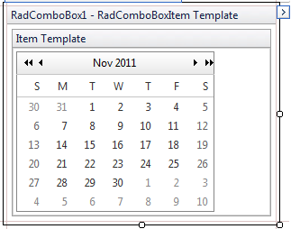
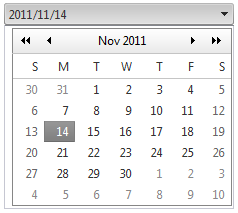

# Adding Templates


## Adding templates at design time

Templates could be added using the [Template Design Surface](). This provides a surface where you can visually design the template with dragging and dropping controls from the Toolbox.

The following example demonstrates how to use the Template Design Surface to add a __RadCalendar__ control to the ItemTemplate.

1. Drag a __RadComboBox__ from the Toolbox onto your web page.

1. From the Smart Tag that appears when you drop the __RadComboBox__, choose __Edit Templates__.

1. The Template Design Surface appears, set for editing the __ItemTemplate__.

1. Drag a __RadCalendar__ control from the Toolbox onto the Template Design Surface.

1. Right click on the __RadCalendar__ control, choose __Properties__ from its context menu, and set the following properties:

* Set the __TitleFormat__ property to "MMM yyyy".

* Set the __ShowRowHeaders__ property to __False__.

* Set the __AutoPostBack__ property to __True__.

* Set the __EnableMultiSelect__ property to __True__.

1. Subscribe the __RadCalendar__ control to its __SelectionChanged__ event: 

>tabbedCode

````C#
	     
	
	protected void RadCalendar1_SelectionChanged(object sender, 
	    Telerik.Web.UI.Calendar.SelectedDatesEventArgs e)
	{    
	    RadCalendar calendar = (RadCalendar)RadComboBox1.SelectedItem.FindControl("RadCalendar1");    
	    RadComboBox1.SelectedItem.Text = String.Format("{0}/{1}/{2}", calendar.SelectedDate.Year, calendar.SelectedDate.Month, calendar.SelectedDate.Day);
	    RadComboBox1.OpenDropDownOnLoad = false;
	}
				
````


````VB.NET
	     
	
	Protected Sub RadCalendar1_SelectionChanged(
	        ByVal sender As Object, 
	        ByVal e As Telerik.Web.UI.Calendar.SelectedDatesEventArgs) 
	        Handles RadCalendar1.SelectionChanged 
	        Dim calendar As RadCalendar = DirectCast(RadComboBox1.SelectedItem.FindControl("RadCalendar1"), RadCalendar)
	        RadComboBox1.SelectedItem.Text = [String].Format("{0}/{1}/{2}", calendar.SelectedDate.Year, calendar.SelectedDate.Month, 
	    calendar.SelectedDate.Day)
	        RadComboBox1.OpenDropDownOnLoad = False
	    End Sub
	
````


>end Note that the event handler finds the RadCalendar control within the RadComboBox's __SelectedItem__ and uses that to set the text of the selected item.

1. Use the Smart Tag anchor to display the Edit Templates pop-up, and choose __End Template Editing__ to close the Template Design Surface.

1. From the Smart Tag, choose __Build RadComboBox__. In the RadComboBox Item Builder, add a single item to the RadComboBox with no __Text__ property. At this point, the declaration for RadComboBox should look as follows:

````ASPNET
	    <telerik:radcombobox id="RadComboBox1" runat="server">      
	    <ItemTemplate>      
	        <telerik:RadCalendar 
	            ID="RadCalendar1"
	            runat="server" 
	            TitleFormat="MMMM yyyy" 
	            ShowRowHeaders="false" 
	            OnSelectionChanged="FromDateChanged" 
	            AutoPostBack="true"
	            EnableMultiSelect="false">      
	        </telerik:RadCalendar>   
	    </ItemTemplate>  
	    <Items>     
	        <telerik:RadComboBoxItem />  
	    </Items>
	    </telerik:radcombobox>
````


1. Run the application.When you click the RadComboBox's drop-down toggle, the RadCalendar appears. The RadCalendar selected date becomes the selected text in the RadComboBox:

## Adding templates at runtime

You can also add templates to __RadComboBox__ at runtime, using the __ItemTemplate__ and __HeaderTemplate__ properties. These properties are of type __ITemplate__, so you must assign objects that implement that interface.

>note The RadComboBox items should be dynamically added so that templates can be defined at run time.
>Also, __items should be bound__ so that DataBinder.Eval expressions may be used. In other words, you should call the __DataBind__ method of the RadComboBox object or bind the items that are about to use __DataBinder.Eval__ . You can bind a specific item by calling the __DataBind__ method of this specific item.
>


>caution The __ItemTemplate__ should be initialized in the __OnInit__ event of the page. This is needed as the template should be instantiated before RadComboBox items are initialized.
>


>tabbedCode

````C#
	     
	
	protected override void OnInit(EventArgs e)
	{    
	    RadComboBox1.ItemTemplate = new LabelTemplate();    
	    base.OnInit(e);
	}
	protected void Page_Load(object sender, EventArgs e)
	{    
	    if (!Page.IsPostBack)    
	    {       
	        RadComboBox1.Items.Add(new RadComboBoxItem("RadComboBoxItem4"));       
	        RadComboBox1.Items.Add(new RadComboBoxItem("RadComboBoxItem5"));    
	    }
	
	    RadComboBox1.DataBind();
	}
	    
	    class LabelTemplate : ITemplate
	    {    
	        public void InstantiateIn(Control container)    
	        {        
	            Label label1 = new Label();        
	            label1.ID = "ItemLabel";        
	            label1.Text = "Text";        
	            label1.Font.Size = 15;        
	            label1.Font.Bold = true;        
	            label1.DataBinding += new EventHandler(label1_DataBinding);        
	            container.Controls.Add(label1);     
	        }
	
	     private void label1_DataBinding(object sender, EventArgs e)     
	     {         
	         Label target = (Label)sender;         
	         RadComboBoxItem item = (RadComboBoxItem)target.BindingContainer;         
	         string itemText = (string)DataBinder.Eval(item, "Text");         
	         target.Text = itemText;     
	     }
	    }
				
````


````VB.NET
	
	
	    Protected Overloads Overrides Sub OnInit(ByVal e As EventArgs)
	        RadComboBox1.ItemTemplate = New LabelTemplate()
	        MyBase.OnInit(e)
	    End Sub
	
	    Protected Sub Page_Load(ByVal sender As Object, ByVal e As EventArgs)
	
	        If Not Page.IsPostBack Then
	            RadComboBox1.Items.Add(New RadComboBoxItem("RadComboBoxItem4"))
	            RadComboBox1.Items.Add(New RadComboBoxItem("RadComboBoxItem5"))
	        End If
	        RadComboBox1.DataBind()
	    End Sub
	
	    Class LabelTemplate
	        Implements ITemplate
	        Public Sub InstantiateIn(ByVal container As Control) Implements ITemplate.InstantiateIn
	            Dim label1 As Label = New Label
	            label1.ID = "ItemLabel"
	            label1.Text = "Text"
	            label1.Font.Size = 15
	            label1.Font.Bold = True
	            AddHandler label1.DataBinding, AddressOf Me.label1_DataBinding
	            container.Controls.Add(label1)
	        End Sub
	        Private Sub label1_DataBinding(ByVal sender As Object, ByVal e As EventArgs)
	            Dim target As Label = CType(sender, Label)
	            Dim item As RadComboBoxItem = CType(target.BindingContainer, RadComboBoxItem)
	            Dim itemText As String = CType(DataBinder.Eval(item, "Text"), String)
	            target.Text = itemText
	        End Sub
	    End Class
	End Sub
	
````


>end

An alternate method of defining a template in the OnInit event of the page, is to instantiate each item on postback. In the previous example, the LabelTemplate class initializes a label in the InstantiateIn method. In the next example, the InstantiateIn method is called for the LabelTemplate object for each item.

>tabbedCode

````C#
	     
	
	protected void Page_Load(object sender, EventArgs e)
	{            
	    if (!Page.IsPostBack)    
	    {        
	        RadComboBox1.Items.Add(new RadComboBoxItem("RadComboBoxItem4"));        
	        RadComboBox1.Items.Add(new RadComboBoxItem("RadComboBoxItem5"));    
	    }  
	
	    LabelTemplate template = new LabelTemplate();    
	    foreach (RadComboBoxItem item in RadComboBox1.Items)    
	    {                    
	        template.InstantiateIn(item);    
	    }
	        
	    RadComboBox1.DataBind();
	}
				
````


````VB.NET
	
	
	    Protected Sub Page_Load(ByVal sender As Object, ByVal e As EventArgs)
	        If Not Page.IsPostBack Then
	            RadComboBox1.Items.Add(New RadComboBoxItem("RadComboBoxItem4"))
	            RadComboBox1.Items.Add(New RadComboBoxItem("RadComboBoxItem5"))
	        End If
	        Dim template As New LabelTemplate()
	        For Each item As RadComboBoxItem In RadComboBox1.Items
	            template.InstantiateIn(item)
	        Next
	        RadComboBox1.DataBind()
	    End Sub
	
````


>end

The end result of this code looks like the following:


