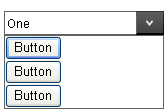
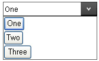

# Data Binding in Templates


## 

When item templates are used, the controls in the template, need to display information associated with RadComboBox item data. Otherwise, the items will all appear the same. For example, consider a simple RadComboBox with a button in the item template:

````ASPNET
	    
<telerik:radcombobox id="RadComboBox1" runat="server" skin="Default">
	<ItemTemplate>
		<asp:Button ID="Button1" runat="server" Text="Button" />
	</ItemTemplate>
	<Items>
		<telerik:RadComboBoxItem runat="server" Text="One" />
		<telerik:RadComboBoxItem runat="server" Text="Two" />
		<telerik:RadComboBoxItem runat="server" Text="Three" />
	</Items>
</telerik:radcombobox>
	    
````


When you run the application, RadComboBox displays a list of identical buttons in its drop-down list:



This is hardly useful! To override the **Text** property of the button in the template, the **DataBinder.Eval** statement is used, just as in the example below:

````ASPNET
	    
<telerik:radcombobox id="RadComboBox1" runat="server" skin="Default">
	<ItemTemplate>
		<asp:Button ID="Button1" runat="server" Text='<%# DataBinder.Eval(Container, "Text") %>' />
	</ItemTemplate>
	<Items>
		<telerik:RadComboBoxItem runat="server" Text="One" />
		<telerik:RadComboBoxItem runat="server" Text="Two" />
		<telerik:RadComboBoxItem runat="server" Text="Three" />
	</Items>
</telerik:radcombobox>
	
````


In the DataBinder.Eval statement, **Container** is the RadComboBoxItem and **"Text"** identifies the **Text** property of that item. (If you wanted to bind to the **Value** property, you could use the string "Value" instead.)

>tip In this example, the first parameter to the DataBinder.Eval statement is **Container** , because the items are statically bound. If the RadComboBox is bound to a data source, the **Container.DataItem** statement should be used instead. That is <%#DataBinder.Eval(Container.DataItem, "Text") %>
>


In addition to adding a DataBinder.Eval statement, you must also explicitly call the DataBind method for the items so that the template has access to the **Text** property:


````C#
	     	
protected void Page_Load(object sender, EventArgs e)
{   
	for (int i = 0; i < RadComboBox1.Items.Count; i++)   
	{       
		RadComboBox1.Items[i].DataBind();   
	}  
}
				
````
````VB.NET
	     
Protected Sub Page_Load(ByVal sender As Object, ByVal e As EventArgs) Handles Me.Load

	Dim i As Integer = 0
	While i < RadComboBox1.Items.Count
		RadComboBox1.Items(i).DataBind()
		i = i + 1
	End While

End Sub
	
````


Now the text of the RadComboBox items appears on the buttons:



# See Also

 * [Data Binding Overview]()

 * [ComboBox Items Overview]()
