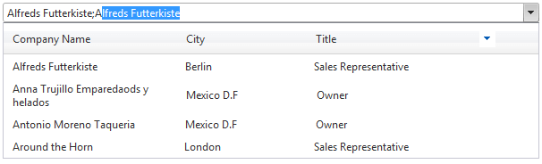

# Headers


**HeaderTemplate** element of the RadComboBox, allows the header of the items in the drop-down list, to be customized. The header is especially useful if your item template displays attributes in multiple columns, although it can be used with any RadComboBox item style. It could be used even when RadComboBox does not have an **ItemTemplate** defined. Like the ItemTemplate, the HeaderTemplate can include any HTML element.

The following example shows how to create a multi-column RadComboBox with a header that labels the columns of each item.

>tip Both, the **HeaderTemplate** and **ItemTemplate** , lay out items using a table that fixes column width, so that the header and items line up properly.
>


## Defining HeaderTemplates inline

````C#
<telerik:radcombobox 
	id="RadComboBox1" 
	runat="server"
	height="190px" 
	width="420px"
	markfirstmatch="true" 
	datasourceid="MyDataSource" 
	highlighttemplateditems="true"
	onitemdatabound="RadComboBox1_ItemDataBound"> 
<HeaderTemplate>   
	<table style="width: 415px; text-align: left">     
		<tr>        
			<td style="width: 125px;">Company Name</td>        
			<td style="width: 125px;">City</td>        
			<td style="width: 125px;">Title</td>        
			<td style="width: 40px;" align="right">            
				        
			</td>     
		</tr>   
	</table> 
</HeaderTemplate> 
<ItemTemplate>   
	<table style="width: 415px; text-align: left">     
	<tr>        
		<td style="width: 125px;">            
			<%# DataBinder.Eval(Container.DataItem, "CompanyName") %>        
		</td>        
		<td style="width: 125px;">
			<%# DataBinder.Eval(Container.DataItem, "City") %>        
		</td>        
		<td style="width: 125px;">
			<%# DataBinder.Eval(Container.DataItem, "ContactTitle") %>        
		</td>        
		<td style="width: 40px;"></td>     
	</tr>  
	</table> 
</ItemTemplate>
</telerik:radcombobox>
````


**ItemDataBound**


````C#
	     
protected void RadComboBox1_ItemDataBound(object sender, RadComboBoxItemEventArgs e)
{  
	e.Item.Text = ((DataRowView)e.Item.DataItem)["CompanyName"].ToString() + "; " +
				  ((DataRowView)  e.Item.DataItem)["City"].ToString() + "; " +                
				  ((DataRowView)e.Item.DataItem)["ContactTitle"].ToString();
}
				
````
````VB.NET
	     
Protected Sub RadComboBox1_ItemDataBound(ByVal sender As Object, ByVal e As RadComboBoxItemEventArgs)

	e.Item.Text = (DirectCast(e.Item.DataItem, DataRowView))("CompanyName").ToString() + "; " +
				  (DirectCast(e.Item.DataItem, DataRowView))("City").ToString() + "; " +
				  (DirectCast(e.Item.DataItem, DataRowView))("ContactTitle").ToString()
End Sub
	
````


The result looks as follows:



## Defining HeaderTemplates at run-time

````ASPNET
<telerik:radcombobox 
	id="RadComboBox1" 
	runat="server" 
	radcomboboximageposition="Right"
	autopostback="true">            
</telerik:radcombobox>
````


````C#
	     
	
protected override void OnInit(EventArgs e)
{    
	RadComboBox1.HeaderTemplate = new HeaderTemplate();    
	base.OnInit(e);
}
protected void Page_Load(object sender, EventArgs e)
{    
	if (!Page.IsPostBack)    
	{        
		RadComboBox1.Items.Add(new RadComboBoxItem("RadComboBoxItem4"));        
		RadComboBox1.Items.Add(new RadComboBoxItem("RadComboBoxItem5"));    
	}

	RadComboBox1.DataBind();
}

class HeaderTemplate : ITemplate
{    
	public void InstantiateIn(Control container)    
	{        
		HtmlTable table = new HtmlTable();        
		HtmlTableRow row = new HtmlTableRow();
		HtmlTableCell cell = new HtmlTableCell();        
		cell.InnerText = "Value";        
		row.Controls.Add(cell);
		HtmlTableCell cell1 = new HtmlTableCell();        
		cell1.InnerText = "Text";        
		row.Controls.Add(cell1);
		table.Controls.Add(row);        
		container.Controls.Add(table);    
	}
}
				
````
````VB.NET
	
	
Protected Overloads Overrides Sub OnInit(ByVal e As EventArgs)

	RadComboBox1.HeaderTemplate = New HeaderTemplate()
	MyBase.OnInit(e)

End Sub
Protected Sub Page_Load(ByVal sender As Object, ByVal e As EventArgs)

	If Not Page.IsPostBack Then

		RadComboBox1.Items.Add(New RadComboBoxItem("RadComboBoxItem4"))
		RadComboBox1.Items.Add(New RadComboBoxItem("RadComboBoxItem5"))

	End If

	RadComboBox1.DataBind()

End Sub

Class HeaderTemplate Implements ITemplate 

	Public Sub InstantiateIn(ByVal container As Control) Implements ITemplate.InstantiateIn

		Dim table As New HtmlTable()
		Dim row As New HtmlTableRow()
		Dim cell As New HtmlTableCell()
		cell.InnerText = "Value"
		row.Controls.Add(cell)
		Dim cell1 As New HtmlTableCell()
		cell1.InnerText = "Text"
		row.Controls.Add(cell1)
		table.Controls.Add(row)
		container.Controls.Add(table)

	End Sub

End Class
	
````


## Accessing controls in HeaderTemplate

You can find any control embedded in the RadComboBox' HeaderTemplate, like:


````C#
	     
Button btn = (Button)RadComboBox1.Header.FindControl("Button1");
btn.Text = "New Text";
				
````
````VB.NET
	
Dim btn As Button = CType(RadComboBox1.Header.FindControl("Button1"), Button)
btn.Text = "New Text"
	
````


# See Also

 * [Footers]()
