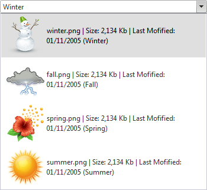
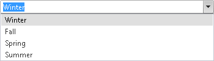

# Templates Overview


**Templates** are fully supported bu RadComboBox control. If you do not specify an **ItemTemplate**, all items are rendered using their **Text** property as plain text. If you specify an **ItemTemplate**, then the respective template is used for rendering. You can embed any content inside a template:

* HTML markup.

* ASP.NET server controls.

* Other third-party controls (other Telerik RadControls for ASP.NET as well).

>caution Templates will not work when RadComboBox items are added via a WebService.
>


In design time, add item templates to your **RadComboBox** control using the [Template Design Surface](). **RadComboBox** supports global template which affects the appearance of all items in the control.

## Example

Shows how to use templates to create the following RadComboBox:



An `<ItemTemplate>` section is added to the **RadComboBox** declaration. The image in the template and the text that appears in the template is taken from the RadComboBoxItem using <%# DataBinder.Eval %> statements.

````C#
<telerik:RadComboBox ID="RadComboBox1" MarkFirstMatch="True" runat="server" Height="297px"
	Width="350px" Skin="Default" AutoPostBack="False" HighlightTemplatedItems="True"
	ShowToggleImage="True">
	<ItemTemplate>
		<table >
			<tr>
				<td>
					' alt="" />
				</td>
				<td>
					<%# DataBinder.Eval(Container, "Attributes['DisplayName']") %>
					(<%# DataBinder.Eval(Container, "Text") %>)
				</td>
			</tr>
		</table>
	</ItemTemplate>
	<Items>
		<telerik:RadComboBoxItem ImagePath="winter.png" DisplayName="winter.png | Size: 2,134 Kb | Last Mofified: 01/11/2005"
			Text="Winter"></telerik:RadComboBoxItem>
		<telerik:RadComboBoxItem ImagePath="fall.png" DisplayName="fall.png | Size: 2,134 Kb | Last Mofified: 01/11/2005"
			Text="Fall"></telerik:RadComboBoxItem>
		<telerik:RadComboBoxItem ImagePath="spring.png" DisplayName="spring.png | Size: 2,134 Kb | Last Mofified: 01/11/2005"
			Text="Spring"></telerik:RadComboBoxItem>
		<telerik:RadComboBoxItem ImagePath="summer.png" DisplayName="summer.png | Size: 2,134 Kb | Last Mofified: 01/11/2005"
			Text="Summer"></telerik:RadComboBoxItem>
	</Items>
</telerik:RadComboBox>
````


Before the template can use the RadComboBox item's properties to bind the elements in the template, the application needs to explicitly bind the items by calling **DataBind** method of **RadComboBoxItem** objects.


````C#
	     
	 protected void Page_Load(object sender, EventArgs e)
	 {   
	     for (int i = 0; i < RadComboBox1.Items.Count; i++)   
	     {      
	         RadComboBox1.Items[i].DataBind();   
	     }      
	 }
				
````
````VB.NET
	     
	    Protected Sub Page_Load(ByVal sender As Object, ByVal e As EventArgs) Handles Me.Load
	        Dim i As Integer = 0
	
	        While i < RadComboBox1.Items.Count
	            RadComboBox1.Items(i).DataBind()
	            i = i + 1
	        End While
	    End Sub
	
````


Here is the same RadComboBox **without** the template:



# See Also

 * [Adding Templates]()

 * [Data Binding in Templates]()

 * [Headers]()

 * [Footers]()

 * [Custom Attributes]()
