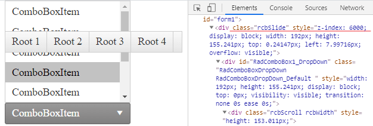
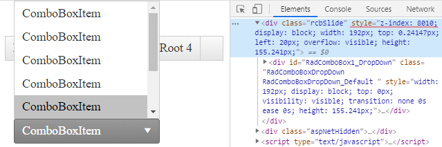
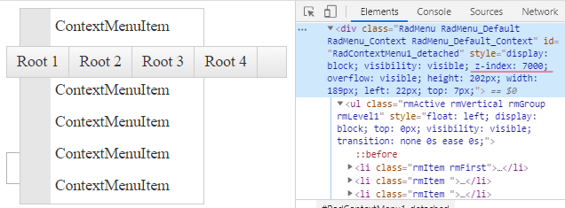
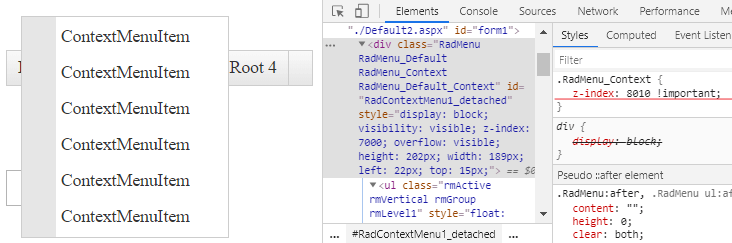
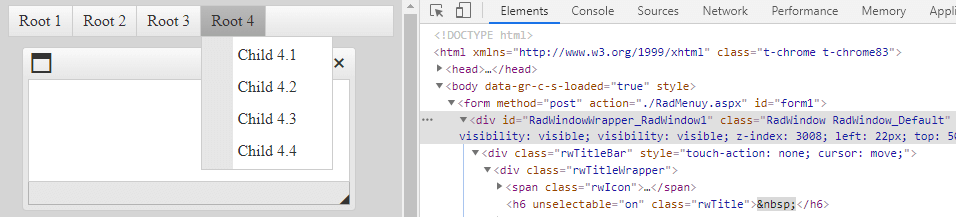
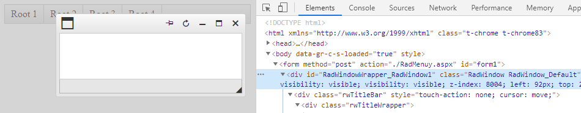

# Controlling Absolute Positioning with z-index


A number of Telerik controls render with absolute positioning and have their default z-indexes as shown below:


* **RadAjaxLoadingPanel** - 90000

* **RadAutoCompleteBox dropdown** - 7000

* **RadButton's SplitButton dropdown** - 7000

* **RadColorPicker popup** - 4001

* **RadComboBox dropdown** - 6000

* **RadDatePicker popup** - 5000

* **RadDropDownList dropdown** - 7000

* **RadDropDownTree dropdown** - 7000

* **RadFilter "add group/expression" dropdown** - 3500

* **RadFormDecorator - decorated dropdown** - 4007

* **RadGrid's PopUp edit form** - 2500

* **RadHtmlChart's tooltips** - 1000

* **RadLightBox** - 3006

* **RadListBox dragged item** - 6500

* **RadListView dragged item** - 99999

* **RadMenu** - 8000. Before expanding an item RadMenu has z-index 7000

* **RadNotification** - 10000

* **RadRibbonBar's Application Menu** - 9000

* **RadRibbonBar's RibbonBarGroup dropdown** - 9000

* **RadScheduler's PopUp edit form** - 2500

* **RadSearchBox dropdown** - 7000

* **RadSplitter's RadSlidingPane** - 2000

* **RadTile's PeekTemplate** - 1

* **RadTile while being dragged** - 99999

* **RadToolBar** - 9000

* **RadToolTip** - 8000

* **RadWindow** - 3000. If **ShowOnTopWhenMaximized** is **true** (its default value), a **maximized RadWindow** will have 100 000 for its z-index.


In different scenarios, you may need to change these values in order to ensure that one specific control will be shown above the other—for example **RadWindow** over **RadMenu**. To do this, you can simply set the value of the z-index property of every control by using the common style property, e.g.:

````ASPX
<telerik:RadWindowManager RenderMode="Lightweight" ID="RadWindowManager1" runat="server" Style="z-index: 12345">
</telerik:RadWindowManager>
````

## Sample scenarios when overriding z-index is necessary

### RadMenu overlapping RadComboBox DropDown (Slide)

**Default appearance**



**Desired appearance**



To achieve the appearance above, apply the following CSS style to override the default z-index of the RadComboBox Slide

````CSS
.rcbSlide{
    z-index:8010 !important;
}
````

Another approach is to set the z-index inline in the RadComboBox declaration

````ASPX
<telerik:RadComboBox ID="RadComboBox1" runat="server" style="z-index:8010">
````


### RadMenu overlapping RadContextMenu

**Default appearance**



**Desired appearance**



The applied CSS style to override the default z-index of the RadContextMenu:

````CSS
.RadMenu_Context{
    z-index:8010 !important;
}
````

### RadMenu overlapping modal RadWindow

**Default appearance**



**Desired appearance**



Override the default z-index of the modal RadWindow with the following style:

````CSS
.RadWindow {
    z-index: 8010 !important;
}
````

Another approach is to apply inline styles in the markup declaration

````ASPX
<telerik:RadWindow ID="RadWindow1" runat="server" Modal="true" style="z-index:8010"></telerik:RadWindow>
````

*Related resources*

- [RadMenu Overlaps RadWindow](https://docs.telerik.com/devtools/aspnet-ajax/controls/window/troubleshooting/common-issues#radmenu-overlaps-radwindow)
- [Show RadWindow above RadMenu](https://www.telerik.com/support/kb/aspnet-ajax/details/show-radwindow-above-radmenu)


