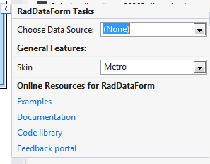
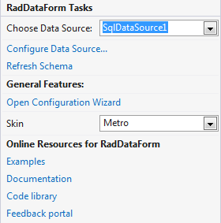
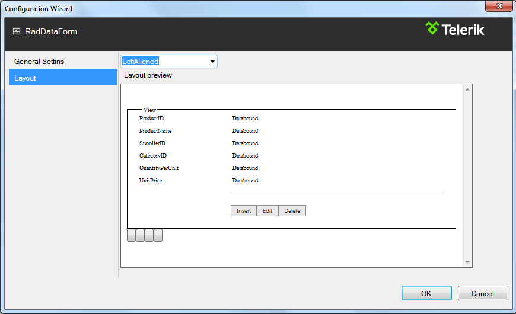
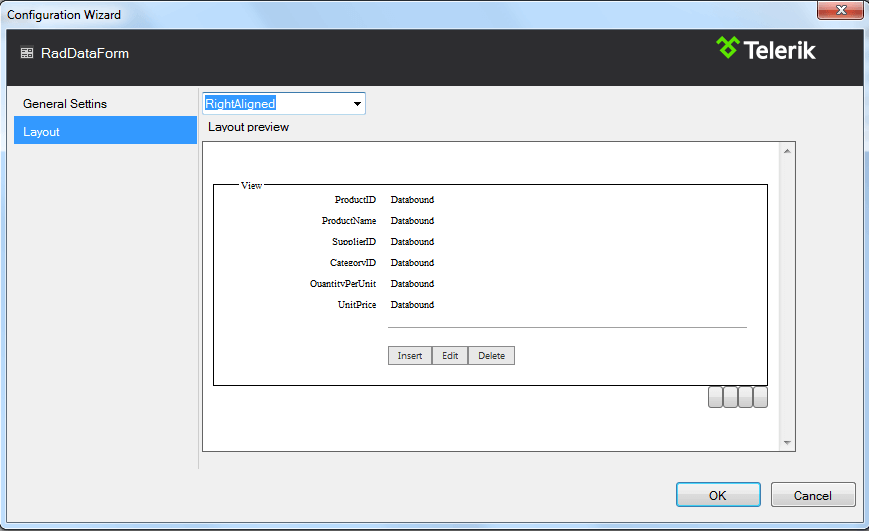
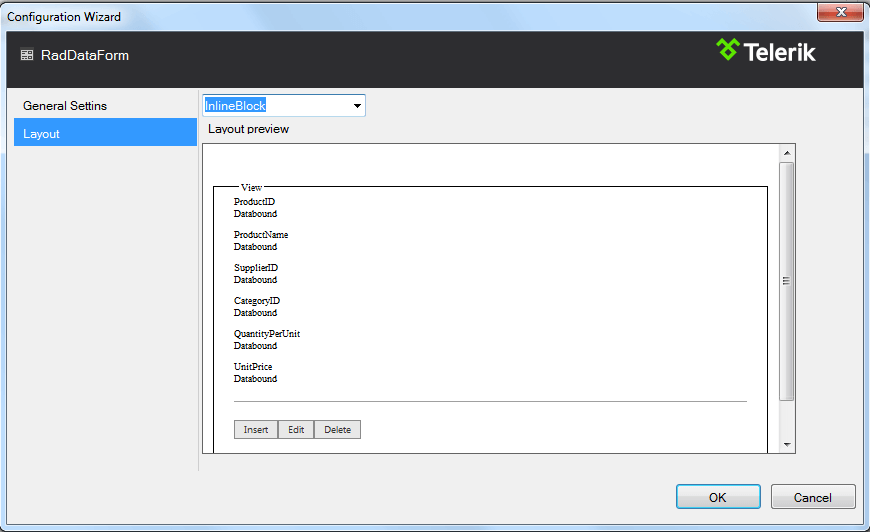
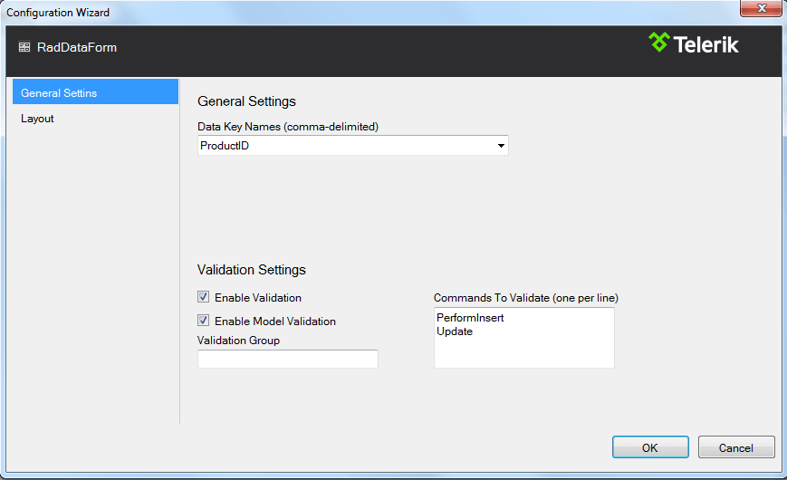

# Design Time

The **RadDataForm** designer provides a **Smart Tag** that allows easy access to frequently needed configuration options. You can display it by right clicking on the control in the design window, and choosing **Show Smart Tag** from its context menu, or by simply clicking on the arrow button on top-right corner of the control.

## Smart Tag

The Smart Tag enables easy visual configuration of the control at design-time.

RadDataForm Smart Tag lets you perform the following (ref. Image2):

* Choose DataSource for the control

* When DataSource is selected you could:

* Configure the DataSource

* Open Configuration Wizard: - Opens the **RadDataForm** window for further customization of the control settings.

* Set Skin -The Skin drop-down lets you select from a list of available skins to customize the look of your DataForm control

* Links navigate you directly to RadDataForm examples, help or Code Library.

## RadDataForm Configuration Wizard

The wizard will smoothly guide you through the various settings and properties of **RadDataForm** providing an accessible and organized way of configuring the control.

* **Layouts** - the layouts drop-down lets you selectd from a list of three predefined layouts

* LeftAligned

* RightAligned

* InlineBlock

* **General settings**- Gives you and ability to set a **DataKeyName** and the **Validation** configuration for the control

