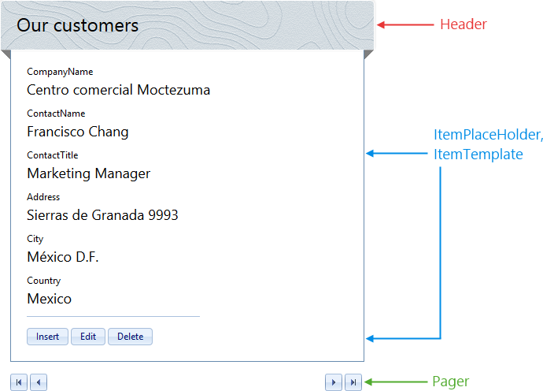

# Layout Templates


## Predefined Layouts

**RadDataForm** gives you the opportunity to specify custom layouts and thus display your data in any preferable way. In addition,as a greater convenience to the developer, the control offers several predefined layouts that enable you to display your data:

* LeftAligned

* RightAligned

* InlineBlock

In order to take advantage of this feature of **RadDataForm**, you need to use the smart tag control designer and pick the **Open Configuration Wizard** option. It will be available once an appropriate data source is assigned to the control.

**This will open the configuration window.**


The designer will open a Configuration Wizard window where you can adjust two types of options:

* General Settings

* Layouts

In order to use the predefined layouts, you should choose the second option.

**Use the drop down menu to select the preferred layout type.**


After a layout has been chosen, the designer will automatically generate the necessary mark-up and main function buttons. Below is theauto-generated mark-up for the **LeftAligned** layout of a **RadDataForm** bound to the Orders table of thewidespread **Northwind** database.

````ASPNET
<telerik:RadDataForm RenderMode="Lightweight" runat="server" ID="RadDataForm1" DataSourceID="SqlDataSource1" Skin="Metro">
    <LayoutTemplate>
        <div class="RadDataForm RadDataForm_<%# Container.Skin %> rdfLeftAligned rdfNoFieldHint rdfNoFieldHint" style="width: 400px;">
            <div id="itemPlaceholder" runat="server">
            </div>
            <div class="rdfPager">
                <span>
                    <asp:Button ID="btnFirst" runat="server" CommandArgument="First" CommandName="Page" CssClass="rdfFirst" Text=" " ToolTip="First" />
                    <asp:Button ID="btnPrev" runat="server" CommandArgument="Prev" CommandName="Page" CssClass="rdfPrev" Text=" " ToolTip="Previous" />
                </span><span>
                    <asp:Button ID="btnNext" runat="server" CommandArgument="Next" CommandName="Page" CssClass="rdfNext" Text=" " ToolTip="Next" />
                    <asp:Button ID="btnLast" runat="server" CommandArgument="Last" CommandName="Page" CssClass="rdfLast" Text=" " ToolTip="Last" />
                </span>
            </div>
        </div>
    </LayoutTemplate>
    <ItemTemplate>
        <fieldset class="rdfFieldset rdfBorders">
            <legend class="rdfLegend">Order Details</legend>
            <div class="rdfCommandButtons">
                <asp:Label ID="Label1" runat="server" Text="Country of Order: "></asp:Label>
                <asp:Label ID="Label2" runat="server" Text='<%# Eval("ShipCountry") %>' Font-Bold="true"></asp:Label>
                <hr class="rdfHr" />
                <telerik:RadButton RenderMode="Lightweight" ID="InitInsertButton" runat="server" ButtonType="SkinnedButton" CausesValidation="False" CommandName="InitInsert" Text="Insert" ToolTip="Insert" />
                <telerik:RadButton RenderMode="Lightweight" ID="EditButton" runat="server" ButtonType="SkinnedButton" CausesValidation="False" CommandName="Edit" Text="Edit" ToolTip="Edit" />
                <telerik:RadButton RenderMode="Lightweight" ID="DeleteButton" runat="server" ButtonType="SkinnedButton" CausesValidation="False" CommandName="Delete" Text="Delete" ToolTip="Delete" />
            </div>
        </fieldset>
    </ItemTemplate>
    <EditItemTemplate>
        <fieldset class="rdfFieldset rdfBorders">
            <legend class="rdfLegend">Edit</legend>
            <div class="rdfCommandButtons">
                <asp:Label ID="Label3" runat="server" Text="Country: "></asp:Label>
                <telerik:RadTextBox RenderMode="Lightweight" ID="RadTextBox1" runat="server" Text='<%# Bind("ShipCountry") %>'></telerik:RadTextBox>
                <hr class="rdfHr" />
                <telerik:RadButton RenderMode="Lightweight" ID="UpdateButton" runat="server" ButtonType="SkinnedButton" CommandName="Update" Text="Update" ToolTip="Update" />
                <telerik:RadButton RenderMode="Lightweight" ID="CancelButton" runat="server" ButtonType="SkinnedButton" CausesValidation="False" CommandName="Cancel" Text="Cancel" ToolTip="Cancel" />
            </div>
        </fieldset>
    </EditItemTemplate>
    <InsertItemTemplate>
        <fieldset class="rdfFieldset rdfBorders">
            <legend class="rdfLegend">Insert</legend>
            <div class="rdfCommandButtons">
                <asp:Label ID="Label4" runat="server" Text="Country: "></asp:Label>
                <telerik:RadTextBox RenderMode="Lightweight" ID="RadTextBox2" runat="server" Text='<%# Bind("ShipCountry") %>'></telerik:RadTextBox>
                <hr class="rdfHr" />
                <telerik:RadButton RenderMode="Lightweight" ID="PerformInsertButton" runat="server" ButtonType="SkinnedButton" CommandName="PerformInsert" Text="Insert" ToolTip="Insert" />
                <telerik:RadButton RenderMode="Lightweight" ID="RadButton1" runat="server" ButtonType="SkinnedButton" CausesValidation="False" CommandName="Cancel" Text="Cancel" ToolTip="Cancel" />
            </div>
        </fieldset>
    </InsertItemTemplate>
    <EmptyDataTemplate>
        <div class="RadDataForm RadDataForm_<%# Container.Skin %>">
            <div class="rdfEmpty">
                There are no items to be displayed.
            </div>
        </div>
    </EmptyDataTemplate>
</telerik:RadDataForm>
<asp:SqlDataSource ID="SqlDataSource1" runat="server"
    ConnectionString="<%$ ConnectionStrings:ConnectionString %>"
    SelectCommand="SELECT [OrderID], [OrderDate], [Freight], [ShipName], [ShipCountry] FROM [Orders]"></asp:SqlDataSource>
````


## Custom Layout

Telerik **RadDataForm** supports complete customization of the layout. Using the LayoutTemplate and ItemTemplate, you can define a repeating HTMLpattern that can build up various layout structures.

**You can add a company logo, contact information or build your own advanced layout configuration to match your specific needs.**


Moreover, including a **RadDataPager** provides you with off-the-shelf paging functionality to add to the control. You may check the demo links below for sample demonstration.

# See Also

 * [Overview]()

 * [RadDataPager Overview](http://www.telerik.com/help/aspnet-ajax/datapager-overview.html)

 * [Overview Sample](http://demos.telerik.com/aspnet-ajax/dataform/overview/defaultcs.aspx)

 * [Server-side Binding Demo](http://demos.telerik.com/aspnet-ajax/DataForm/Data-Binding/Server-side-Binding/DefaultCS.aspx)
