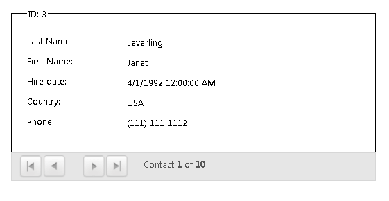

# Getting Started


This tutorial will walk you through the creation of a sample application that contains __RadDataForm__ and will show you how to:

* Use __RadDataForm__ in your project

* Bind __RadDataForm__ through __NeedDataSource__ event

* Bind __DataForm__ to a declarative __DataSource__ control

For the purpose of exemplifying this, you will need to create an empty Web.UI Application project and open it in Visual Studio.

## Adding RadDataForm to the Project

1. Create a new ASP.NET project

1. Add references to the assemblies __Telerik.Web.UI__, __Telerik.Web.UI.Skin__s, and __Telerik.Web.Design__

1. Add the __RadDataForm__ as demonstrated below:

````ASPNET
	        <telerik:raddataform runat="server" id="RadDataForm1">
	                
	            </telerik:raddataform>
````


## Binding RadDataForm through NeedDataSource event

Firstly, for the purpose of this tutorial, we will create a new data table with a single row

>tabbedCode

````C#
	
	    public DataTable GetDataTable()
	    {
	
	        DataTable table = new DataTable();
	        table.Columns.Add("FirstName");
	        table.Columns.Add("LastName");
	        table.Columns.Add("Occupation");
	        table.Columns.Add("Salary", typeof(Int32));
	        table.Columns.Add("IsMarried", typeof(bool));
	        table.Columns.Add("StartingDate", typeof(DateTime));
	        table.Rows.Add("Sarah", "Blake", "Product Manager", 3500, true, "01/02/2014 00:00:00");
	        return table;
	    }
````
````VB
	
	    Public Function GetDataTable() As DataTable
	
	        Dim table As New DataTable()
	        table.Columns.Add("FirstName")
	        table.Columns.Add("LastName")
	        table.Columns.Add("Occupation")
	        table.Columns.Add("Salary", GetType(Int32))
	        table.Columns.Add("IsMarried", GetType(Boolean))
	        table.Columns.Add("StartingDate", GetType(DateTime))
	        table.Rows.Add("Sarah", "Blake", "Product Manager", 3500, True, "01/02/2014 00:00:00")
	        Return table
	    End Function
	
````
>end

Once data table is defined, you may use it to bind it to the __RadDataForm__ through the __NeedDataSource__ event:

>tabbedCode

````ASPNET
	        <telerik:raddataform runat="server" id="RadDataForm1" onneeddatasource="RadDataForm1_NeedDataSource">
	                
	            </telerik:raddataform>
````
````C#
	
	    public DataTable GetDataTable()
	    {
	
	        DataTable table = new DataTable();
	        table.Columns.Add("FirstName");
	        table.Columns.Add("LastName");
	        table.Columns.Add("Occupation");
	        table.Columns.Add("Salary", typeof(Int32));
	        table.Columns.Add("IsMarried", typeof(bool));
	        table.Columns.Add("StartingDate", typeof(DateTime));
	        table.Rows.Add("Sarah", "Blake", "Product Manager", 3500, true, "01/02/2014 00:00:00");
	        return table;
	    }
	
	    protected void RadDataForm1_NeedDataSource(object sender, RadDataFormNeedDataSourceEventArgs e)
	    {
	
	        this.RadDataForm1.DataSource = this.GetDataTable();
	    }
````
````VB
	    Public Function GetDataTable() As DataTable
	
	        Dim table As New DataTable()
	        table.Columns.Add("FirstName")
	        table.Columns.Add("LastName")
	        table.Columns.Add("Occupation")
	        table.Columns.Add("Salary", GetType(Int32))
	        table.Columns.Add("IsMarried", GetType(Boolean))
	        table.Columns.Add("StartingDate", GetType(DateTime))
	        table.Rows.Add("Sarah", "Blake", "Product Manager", 3500, True, "01/02/2014 00:00:00")
	        Return table
	    End Function
	
	    Protected Sub RadDataForm1_NeedDataSource(sender As Object, e As RadDataFormNeedDataSourceEventArgs)
	
	        Me.RadDataForm1.DataSource = Me.GetDataTable()
	    End Sub
````
>end

After applying the __DataSource__ you can add the required templates in the __DataForm__ markup:

````ASPNET
	        <telerik:raddataform runat="server" id="RadDataForm1" onneeddatasource="RadDataForm1_NeedDataSource" skin="Glow">
	                <LayoutTemplate>
	                    <div >
	                        <div id="itemPlaceholder" runat="server"></div>
	                    </div>
	                </LayoutTemplate>
	                <ItemTemplate>
	                    <fieldset class="rdfFieldset rdfBorders">
	                        <div class="rdfRow">
	                            <asp:Label runat="server" ID="Lbl1" Text="First Name:"></asp:Label>
	                            <asp:Label Text='<%# Eval("FirstName") %>' runat="server" ID="lbl2" />
	                        </div>
	                        <div class="rdfRow">
	                            <asp:Label runat="server" ID="lbl3" Text="Lat Name:"></asp:Label>
	                            <asp:Label Text='<%# Eval("LastName") %>' runat="server" ID="lbl4" />
	                        </div>
	                        <div class="rdfRow">
	                            <asp:Label runat="server" ID="lbl5" Text="Occupation:"></asp:Label>
	                            <asp:Label Text='<%# Eval("Occupation") %>' runat="server" ID="lbl6" />
	                        </div>
	                        <div class="rdfRow">
	                            <asp:Label runat="server" ID="lbl7" Text="Salary:"></asp:Label>
	                            <asp:Label Text='<%# Eval("Salary") %>' runat="server" ID="lbl8" />
	                        </div>
	                        <div class="rdfRow">
	                            <asp:Label runat="server" ID="lbl9" Text="IsMarried:"></asp:Label>
	                            <asp:Label Text='<%# Eval("IsMarried") %>' runat="server" ID="lbl10" />
	                        </div>
	                        <div class="rdfRow">
	                            <asp:Label runat="server" ID="lbl11" Text="Starting Date:"></asp:Label>
	                            <asp:Label Text='<%# Eval("StartingDate") %>' runat="server" ID="lbl12" />
	                        </div>
	                    </fieldset>
	                </ItemTemplate>
	            </telerik:raddataform>
````


## Binding RadDataForm to a DataSource control

In order to populate the __DataForm__ control, follow the steps below:

1. Add and configure a __DataSource__ control to your application:

````ASPNET
	        <asp:SqlDataSource ID="SqlDataSource1" runat="server" ConnectionString="<%$ ConnectionStrings:TelerikConnectionString35 %>"
	            SelectCommand="SELECT [EmployeeID], [LastName], [FirstName], [HireDate], [Country], [HomePhone] FROM [Employees_Northwind]"></asp:SqlDataSource>
````


1. Set the __DataSourceID__ of the __DataForm__ control to point to the already configured data source control

1. In order to visualize the retrieved data you should set the __DataForm__ templates (__ItemTemplate__, __LayotTemplate__)

1. As the __DataForm__ will be bound to more than one item in this case, you can enable paging by adding a __RadDataPager__ or custom buttons with corresponding paging functionality in the LayoutTemplate:

The provided steps will lead to a markup similar to this:

````ASPNET
	        <telerik:raddataform runat="server" insertitemposition="FirstItem" id="RadDataForm1" datasourceid="SqlDataSource1"
	            datakeynames="EmployeeID" datasourcecount="0" resolvedrendermode="Classic">
	        
	            <LayoutTemplate>
	                <div class="RadDataForm RadDataForm_<%# Container.Skin %> rdfLeftAligned rdfNoFieldHint">
	                    <div id="Div1" runat="server">
	                    </div>
	                    <telerik:RadDataPager ID="RadDataPager1" runat="server" PagedControlID="RadDataForm1">
	                        <Fields>
	                            <telerik:RadDataPagerButtonField FieldType="FirstPrev" />
	                            <telerik:RadDataPagerButtonField FieldType="NextLast" />
	                            <telerik:RadDataPagerTemplatePageField>
	                                <PagerTemplate>
	                                    <div>
	                                        <label>
	                                            Contact <strong>
	                                                <%#Container.Owner.StartRowIndex+1%></strong> of <strong>
	                                                    <%# Container.Owner.TotalRowCount%></strong></label>
	                                    </div>
	                                </PagerTemplate>
	                            </telerik:RadDataPagerTemplatePageField>
	                        </Fields>
	                    </telerik:RadDataPager>
	                </div>
	            </LayoutTemplate>
	            <ItemTemplate>
	                <fieldset class="rdfFieldset rdfBorders">
	                    <legend class="rdfLegend">ID:
	                        <%#Eval("EmployeeID")%></legend>
	                    <div class="rdfRow">
	                        <asp:Label runat="server" ID="LastNameLabel" CssClass="rdfLabel rdfBlock" Text="Last Name:"></asp:Label>
	                        <asp:Label CssClass="rdfFieldValue" Text='<%# Eval("LastName") %>' runat="server"
	                            ID="LastNameLabel1" />
	                    </div>
	                    <div class="rdfRow">
	                        <asp:Label runat="server" ID="FirstNameLabel" CssClass="rdfLabel rdfBlock" Text="First Name:"></asp:Label>
	                        <asp:Label CssClass="rdfFieldValue" Text='<%# Eval("FirstName") %>' runat="server"
	                            ID="FirstNameLabel1" />
	                    </div>
	                    <div class="rdfRow">
	                        <asp:Label runat="server" ID="HireDateLabel" CssClass="rdfLabel rdfBlock" Text="Hire date:"></asp:Label>
	                        <asp:Label CssClass="rdfFieldValue" Text='<%# Eval("HireDate") %>' runat="server"
	                            ID="HireDateLabel1" />
	                    </div>
	                    <div class="rdfRow">
	                        <asp:Label runat="server" ID="UnitPriceLabel2" CssClass="rdfLabel rdfBlock" Text="Country:"></asp:Label>
	                        <asp:Label CssClass="rdfFieldValue" Text='<%# Eval("Country") %>' runat="server"
	                            ID="UnitPriceLabel1" />
	                    </div>
	                    <div class="rdfRow">
	                        <asp:Label runat="server" ID="HomePhoneLabel" CssClass="rdfLabel rdfBlock" Text="Phone:"></asp:Label>
	                        <asp:Label CssClass="rdfFieldValue" Text='<%# Eval("HomePhone") %>' runat="server"
	                            ID="HomePhoneLabel1" />
	                    </div>
	                </fieldset>
	              </ItemTemplate>
	        </telerik:raddataform>
	
	        <asp:SqlDataSource ID="SqlDataSource1" runat="server" ConnectionString="<%$ ConnectionStrings:TelerikConnectionString35 %>"
	            SelectCommand="SELECT [EmployeeID], [LastName], [FirstName], [HireDate], [Country], [HomePhone] FROM [Employees_Northwind]"></asp:SqlDataSource>
````


On running the application, you will see the following:

# See Also
