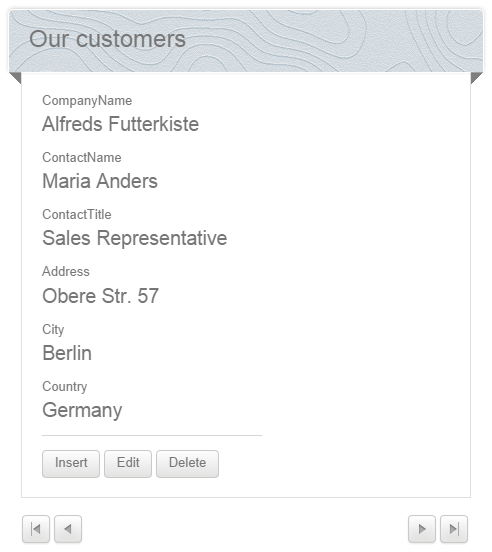

# DataForm Overview

## 

__RadDataForm__ is data oriented control, which displays the values of a single record or collection of data items from a DataSource using user-defined templates. You can use the control designer to autogenerate its fields.

The control provides you with an option to preview, edit, delete, and insert records through the available __ItemTemplate__,__EditItemTemplate__ and __InsertItemTemplate__ templates. The __DataForm__ also provides __EmptyDataTemplate__, which applies when the datasource is empty, as well as the LayoutTemplate for easy customization.

The control supports the rich set of skins provided by the suite.

## Key Features

* Various templates for data and layout presentation

* Data-binding – Server-side

* Insert, Update and Delete operations

* Set of commonly used predefined layouts and unlimited possibilities for creating custom layouts

* Visual Appeal – ships with rich set of skins for easy and consistent styling

# See Also

 * [Getting Started]()

 * [Design Time]()

 * [Layout Templates]()
