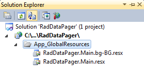
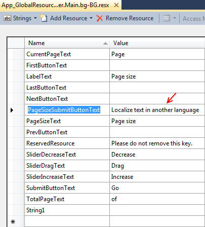
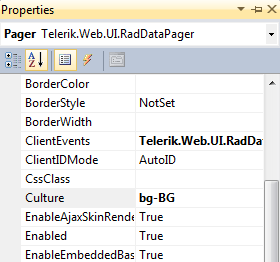

# Localization


To localize the RadDataPager control you can use global resource files or directly change the values of each named field-property:

````ASPNET
	    <telerik:RadDataPager runat="server" ID="RadDataPager1" PagedControlID="RadListView1">
	        <Fields>
	            <telerik:RadDataPagerButtonField FieldType="FirstPrev" FirstButtonText="Custom text" />
	        </Fields>
	    </telerik:RadDataPager>
````


>note RadDataPager's default __Culture__ is taken from the page's __CurrentUICulture__ .
>


## Global Resource Files

The primary means for localization in ASP.NET is to use resource files. Resource files are simple XML files that can be easily edited and transferred to other applications. You can use resource files to change the default (English) localization for RadDataPager that is stored in the Telerik.Web.UI assembly.

To create a global resource file to localize the pager:

1. Create the App_GlobalResources folder in the root of your web application.

1. Copy the default resource RadDataPager.Main.resx file into it. This file can be found in the App_GlobalResources folder of the directory where you installed the Telerik controls.

1. Make a copy of the file and rename the copy so that its name contains the Culture Identifier. The resource files used by RadDataPager follow a strict naming convention: RadDataPager.Main.<Culture Identifier>.resx

>note The Culture Identifier consists of a language code followed by a dash and the country code. Example: "en-US", "fr-CA", "bg-BG" and so on.
>
For example RadDataPager.Main.bg-BG.resx. Both files should be present in the App_GlobalResources folder:

1. Edit the strings using the Visual Studio editor or your favorite text editor. Customize strings just as you would set the Localization property.

>caution Make sure that the __ReservedResource__ message is preserved. It is used for identification purposes and is never displayed.
>


You can now switch the pager so that it uses your new resource file by setting the active culture:
