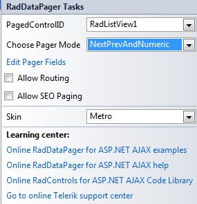

# Design Time

The RadDataPager __Smart Tag__ provides convenient access to the most common settings for the control. You can display the Smart Tag by right clicking on the RadDataPager in the design window and choosing the "Show Smart Tag" option from its context menu.

The options which are exposed through the Smart Tag are:

## Pager Mode

Specifies the way the navigation buttons are displayed. You can have navigation buttons appear as page numbers or as previous/next buttons with text, as slider or numeric text box and button.

## Pager Fields

The Pager Fields collection allows you to customize the way navigation is performed. You can use one or more pager field objects in a single RadDataPager control, which will help the site visitor to navigate through the data visualized by its container control.

## Allow Routing and SEO Paging

The __"Allow Routing" and "Allow SEO Paging"__ checkboxes enables this fucntionalities for the RadDataPager control.

## Skin

The Skin drop-down displays a list of available predefined skins that you can apply to the RadDataPager control. Assign a skin by selecting the one you want from the list.
