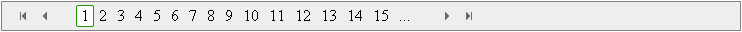

# Elements


## 

The RadDataPager control has a number of fields you can use for designing your own pager. It lets you choose the controls that will appear in the pager field to help users navigate through the pages. To specify the pager fields, list the desired field elements between the opening and closing <Fields> tag inside the RadDataPager control.

The RadDataPager built-in fields are: RadDataPagerButtonField, RadDataPagerPageSizeField, RadDataPagerSliderField, RadDataPagerGoToPageField and RadDataPagerTemplatePageField. You can use one or more pager field objects in a single RadDataPager control.

The following code and images show the different RadDataPager fields:


**RadDataPagerButtonField**

When RadDataPager contains a **RadDataPagerButtonField** you have the ability to add arrow buttons for navigation to Next/Previous/First/Last page, link buttons with page numbers or both. The **ID's** of the **buttons** in RadDataPager, when pager field is RadDataPagerButtonField, are listed bellow:

* First button: "FirstButton"

* Previous button: "PrevButton"

* Next button: "NextButton"

* Last button: "LastButton"

````ASPNET
<telerik:RadDataPager ID="RadDataPager1" PagedControlID="RadListView1" PageSize="2"
    runat="server">
    <Fields>
        <telerik:RadDataPagerButtonField FieldType="FirstPrev" FirstButtonText="First" PrevButtonText="Prev" />
        <telerik:RadDataPagerButtonField FieldType="Numeric" PageButtonCount="15" />
        <telerik:RadDataPagerButtonField FieldType="NextLast" NextButtonText="Next" LastButtonText="Last" />
    </Fields>
</telerik:RadDataPager>
````



The RadDataPagerButtonField object exposes the following four properties that can be used to set a url to a custom image for the corresponding paging buttons when SEO paging is enabled for the data pager control:

* FirstButtonImageUrl

* PrevousButtonImageUrl

* NextButtonImageUrl

* LastButtonImageUrl


**RadDataPagerPageSizeField**

When **RadDataPager** contains a **RadDataPagerPageSizeField**, a drop down control for changing the current page size appears. **RadDataPager** exposes the **PageSizeControlType** property on the field which is an enum of type **PagerDropDownControlType**. It has three values available with **RadComboBox** being the default one:

* **None**

* **RadComboBox**

* **RadDropDownList**

As it name implies, the property specifies what type of page size drop down control will be rendered.The property provides an easy wayto switch off the page size combo or replace it with its light weight counterpart **RadDropDownList**.

You can use the **PageSizeText** property of the field to customize the page size text. Since Q3 2011 PageSizes property for the RadDataPagerPageSizeField is added. It allows to customize the page size values that appear in RadComboBox.

The **ID** of the RadComboBox, when pager field is RadDataPagerPageSizeField, is shown bellow:

* RadComboBox: "PageSizeComboBox"

````ASPNET
<telerik:RadDataPager ID="RadDataPager1" PagedControlID="RadListView1" runat="server">
    <Fields>
        <telerik:RadDataPagerPageSizeField PageSizeText="PageSize: " />
    </Fields>
</telerik:RadDataPager>
````


**RadDataPagerSliderField**

When RadDataPager contains a **RadDataPagerSliderField**, RadSlider control for changing pages is shown. This pager field renders a slider which can be used to navigate to the page on interest.

The **ID** of the RadSlider, when pager field is RadDataPagerSliderField, is shown bellow:

* RadSlider: "PageSlider"

````ASPNET
<telerik:RadDataPager ID="RadDataPager1" PagedControlID="RadListView1" runat="server">
    <Fields>
        <telerik:RadDataPagerSliderField SliderDecreaseText="Decrease" SliderDragText="Drag"
            SliderIncreaseText="Increase" SliderOrientation="Horizontal" />
    </Fields>
</telerik:RadDataPager>
````


**RadDataPagerGoToPageField**

When RadDataPager has **RadDataPagerGoToPageField**, RadNumericTextBox and a button for navigating to particular page number appear. RadNumericTextBox allows you to type the desired page number and jump to this page on button click.

The **ID's** of the RadNumericTextBox and the button in the RadDataPager control, when pager field is RadDataPagerGoToPageField, are listed bellow:

* RadNumericTextBox: "GoToPageTextBox"

* Button: "GoToPageButton"

````ASPNET
<telerik:RadDataPager ID="RadDataPager1" PagedControlID="RadListView1" PageSize="5"
    runat="server">
    <Fields>
        <telerik:RadDataPagerGoToPageField CurrentPageText="Page: " TotalPageText="of" SubmitButtonText="Go"
            TextBoxWidth="15" />
    </Fields>
</telerik:RadDataPager>
````


**RadDataPagerNumericPageSizeField**

When RadDataPager contains a **RadDataPagerNumericPageSizeField**, RadNumericTextBox and a button for that let the user enter a new page size appear.

The **ID's** of the RadNumericTextBox and the button in the RadDataPager control, when pager field is RadDataPagerNumericPageSizeField, are listed bellow:

* RadNumericTextBox: "PageSizeTextBox"

* Button: "PageSizeButton"

````ASPNET
<telerik:RadDataPager ID="RadDataPager1" runat="server" PagedControlID="RadListView1"
    PageSize="6">
    <Fields>
        <telerik:RadDataPagerNumericPageSizeField LabelText="PageSize:" SubmitButtonText="Change"
            TextBoxWidth="15" Visible="true" />
    </Fields>
</telerik:RadDataPager>
````


**RadDataPagerTemplatePageField**

When RadDataPager has **RadDataPagerTemplatePageField** you can set the appearance and features of the pager field.

The RadDataPagerTemplatePageField adds a bit of customization to the paging interface. It uses code block to retrieve the total number of rows, the starting row number, and the overall page size to perform calculations. These calculations can be used to display "(items x to y of z)" text as well as the pager links and buttons.

The following example uses the RadDataPagerTemplatePageField to display the number of the first and last last record on the current page number and the total number of records. The RadDataPager control also contains Next/Previous/First/Last to display navigation controls that enable users to page through data.

````ASPNET
<telerik:RadDataPager ID="RadDataPager1" runat="server" PagedControlID="RadListView1">
    <Fields>
        <telerik:RadDataPagerButtonField FieldType="FirstPrev" />
        <telerik:RadDataPagerButtonField FieldType="NextLast" />
        <telerik:RadDataPagerTemplatePageField>
            <PagerTemplate>
                <div style="float: right">
                    <b>Displaying items
                        <asp:Label runat="server" ID="CurrentPageLabel" Text="<%# Container.Owner.StartRowIndex + 1 %>" />
                        to
                        <asp:Label runat="server" ID="TotalPagesLabel" Text="<%# Container.Owner.StartRowIndex + Container.Owner.PageSize %>" />
                        of
                        <asp:Label runat="server" ID="TotalItemsLabel" Text="<%# Container.Owner.TotalRowCount %>" />
                        <br />
                    </b>
                </div>
            </PagerTemplate>
        </telerik:RadDataPagerTemplatePageField>
    </Fields>
</telerik:RadDataPager>
````


