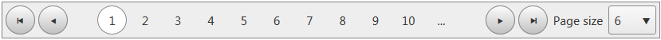
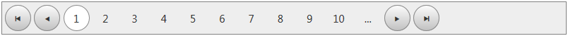

# Mobile Rendering Overview


Since Q2 2015 Beta release of Telerik UI controls **RadDataPager** is optimized for touch devices. The control provides responsive attributes which will allow the developers to actually define a responsive behaviour, in a convenient manner that suits to their set-up.

The responsive attributes are:

* **Hidden[Size]** attribute — These are **HiddenXs** , **HiddenSm** , **HiddenMd** , **HiddenLg** , **HiddenXl**
| If set to "true" | Extra small device/<360px | Small device /<=768px | Medium device/<=1024px | Large device/<=1280px|
| ------ | ------ | ------ | ------ | ------ |
| HiddenXs |hidden|visible|visible|visible|
| HiddenSm |visible|hidden|visible|visible|
| HiddenMd |visible|visible|hidden|visible|
| HiddenLg |visible|visible|visible|hidden|

Example:
````ASP.NET
<%--Hides the RadDataPagerPageSizeField under 768px--%>
<telerik: RadDataPagerPageSizeField HiddenXs="true" HiddenSm="true"/>
````
**Result:** Above 768px (in this case 780px) PageSize field is visible


**Result:** Under 768px PageSize field is hidden


* **Trim[Size]** attribute  — only applicable for **RadDataPagerButtonField FieldType="Numeric"**. These are **TrimXs** , **TrimSm** , **TrimMd** , **TrimLg** , **TrimXl**
| If set to "true" | Extra small device/<360px | Small device /<=768px | Medium device/<=1024px | Large device/<=1280px|
| ------ | ------ | ------ | ------ | ------ |
| TrimXs |trim|all visible|all visible|all visible|
| TrimSm |all visible|trim|all visible|all visible|
| TrimMd |all visible|all visible|trim|all visible|
| TrimLg |all visible|all visible|all visible|trim|

Example:
````ASP.NET
<%--Trims page numbers under 360px--%>
<telerik:RadDataPagerButtonField FieldType="Numeric" TrimXs="true"></telerik:RadDataPagerButtonField>

````
**Result:** Above 768px all page numbers are displayed


**Result:** Under 768px page numbers are trimmed 


* **HorizontalPosition[Size]** attribute  — The values are **Left** , **Center** , **Right**.

Example:
````ASP.NET
<telerik:RadDataPagerButtonField FieldType="FirstPrev" HorizontalPositionMd="Left"></telerik:RadDataPagerButtonField>
<telerik:RadDataPagerButtonField FieldType="Numeric" HorizontalPositionMd="Center"></telerik:RadDataPagerButtonField> 
<telerik:RadDataPagerButtonField FieldType="NextLast" HorizontalPositionMd="Right"></telerik:RadDataPagerButtonField>
````
**Result:** 


>important HorizontalPositionMd="Center" tells that this element will be centered in the interval [769px, 1024px]. Above and below the behaviour is the default one. 
If you want to center this element for each screen size below 1024px you have to write HorizontalPositionXs="Center" HorizontalPositionSm="Center" HorizontalPositionMd="Center".
>