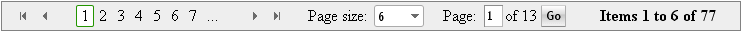

# DataPager Overview

**RadDataPager** can be used to display paging navigation controls for other data-bound controls that implement the **IPageableItemContainer** or **IRadPageableItemContainer** interface (like the RadListView and MS ListView). The RadDataPager control lets users view large sets of data in small chunks for faster loading and easier navigation. It also provides a set of events, helper methods and properties for custom intervention.

You can easily add the RadDataPager control to a Web Form within Visual Studio. The paging interface appears wherever you place the RadDataPager control on the page. You may place it before or after the RadListView control, as well as within its LayoutTemplate element.

The RadDataPager control has the following properties for using it in its default state:

* **PagedControlID** is the ID of the control that implements one of the following interfaces - **IPageableItemContainer** or **IRadPageableItemContainer**. This is the control that will be paged by RadDataPager control. If RadDataPager is placed in Controls collection of IPageableItemContainer / IRadPageableItemContainer setting this property is optional. In case PagedControlID is not set, RadDataPager will attempt to find its container automatically.

* **PageSize** is the number of items and rows to display on each page.

* **StartRowIndex** gets the index of the first record that is displayed on a page of data.

* **TotalRowCount** gets the total number of records that are displayed in the underlying data source.

* **MaximumRows** gets the maximum number of records that are displayed for each page of data.

## RadDataPager field types

The RadDataPager control has a [number of fields]() you can use, including [template]() support for designing your own pager. The following table lists the different RadDataPager fields:

| Pager field type | Description |
| ------ | ------ |
| **RadDataPagerButtonField** |This pager field contains buttons with numeric pages or buttons for navigation to Next/Previous/First/Last page.|
| **RadDataPagerPageSizeField** |This pager field contains RadComboBox for changing the current page size.|
| **RadDataPagerNumericPageSizeField** |This pager field contains RadNumericTextBox and a button that lets the user enter a new page size.|
| **RadDataPagerTemplatePageField** |This pager field enables users to create a custom paging UI.|
| **RadDataPagerGoToPageField** |This pager field contains RadNumericTextBox and a button for navigating to particular page number.|
| **RadDataPagerSliderField** |This pager field contains RadSlider control for changing pages.|

## Events and Methods

Telerik RadDataPager control contains the following sever-side events and methods:

| Event | Description |
| ------ | ------ |
| **FieldCreating** |Fired before a field is created. You can handle the event to load custom pager field on postback and to replace or modify the instance of the field that should be created/added into the collection of field in the corresponding RadDataPager.|
| **FieldCreated** |This event is fired after a pager field is created.|
| **Command** |Fired when any button is clicked or containing control value is changed in RadDataPager control.|

| Method | Description |
| ------ | ------ |
| **FireCommand** |Can be used for manually triggering commands in code rather than clicking the pager buttons, etc.|

## RadDataPager command names and arguments

* **PageCommandName** represents the Page command name which fires the **RadDataPager.PageIndexChanged** event. It can be raised bybuttons residing in the RadDataPager body. Their **CommandName** should be set to **Page** and **CommandArgument** must match one of the values from the table below:

| Paging command arguments | Description |
| ------ | ------ |
| **First** |Indicates that the end user chose to navigate to the first page in the RadDataPager.|
| **Next** |Indicates that the end user chose to navigate to the next page in the container RadDataPager.|
| **Prev** |Indicates that the end user chose to navigate to the previous page in the container RadDataPager.|
| **Last** |Indicates that the end user chose to navigate to the last page in the container RadDataPager.|
| **<NumericValue>** |<NumericValue> should be replaced with number that points to the page to which the control should navigate to.|

* **PageSizeChangeCommandName** represents the PageSizeChange command name which fires **RadDataPager.PageSizeChanged** event. It can be raised by buttons residing in the RadDataPager body. Their **CommandName** should be set to **PageSizeChange** and **CommandArgument** must be the actual number representing the new page size that will be set.
