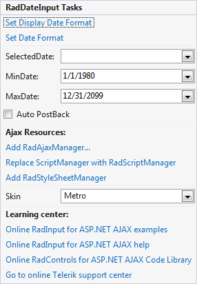

# Smart Tag

The **RadInput** Smart Tag allows easy access to frequently needed tasks. You can display the **Smart Tag** by right clicking on a **RadInput** control in the design window, and choosing **Show Smart Tag** from its context menu.

## RadDateInput

The **RadDateInput** Smart Tag contains the same **Ajax Resources**, **Skin**, and **Learning Center** sections as the other **RadInput** controls. In addition, the **RadDateInput** Smart Tag lets you do the following :

RadDateInput Tasks

* **Set Display Date Format** brings up the [Date Format Dialog](), where you can assign a value to the **DisplayDateFormat** property.The **DisplayDateFormat** property governs the format of the **SelectedDate** value when the **RadDateInput** control does not have focus.

* **Set Date Format** brings up the [Date Format Dialog](), where you can assign a value to the **DateFormat** property.The **DateFormat** property governs the format of the **SelectedDate** value when the **RadDateInput** control has focus (when the user can edit its value).

* **MinDate** specifies the minimal date which the user will be allowed to enter

* **MaxDate** specifies maximal date which the user will be allowed to enter

