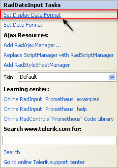
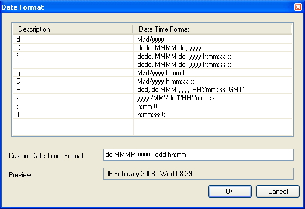
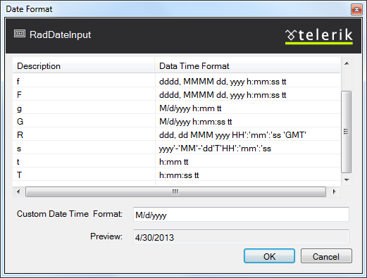
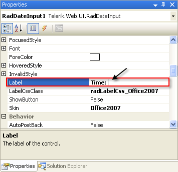
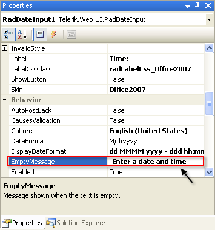

# Getting Started With RadDateInput

This tutorial will walk you through creating a Web page that uses the **RadDateInput** control. It shows how to:

* Use the **RadDateInput**control

* Apply a **Skin** to customize the look and feel.

* Add labels to the input controls.

* Customize the selection behavior when the control receives focus.

* Specify formats for display and editing.

1. Drag a **RadDateInput** control from the toolbox onto your Web page. It's Smart Tag should appear automatically.

1. In the **RadDateInput** Smart Tag, click the link labelled **Set Display Date Format**.

1. The [Date Format dialog]() appears. Enter the string "dd MMMM yyyy - ddd hh:mm" as a **CustomDate Time Format** and click **OK.**

	The string you entered in the **Date Format dialog** becomes the value of the **DisplayDate** property. That is, it is the ASP.NET DateTime format string that the **RadDateInput** control uses to display its current value when it does not have focus.

1. Back in the Smart Tag, click the link labelled **Set Date Format** to bring up the **Data Format dialog** a second time. This time, choose the pre-defined "g" format and click **OK**.

	The format you chose becomes the value of the **DateFormat** property. That is, it is the ASP.NET DateTime format string that the **RadDateInput** control uses to display its current value when it has input focus and the user can edit the value.

1. Set the **Skin** property to "Office2007" so that the **RadDateInput** control matches the two text box controls.

1. In the properties pane for the **RadDateInput** control, set the **Label** property to "Time:"

1. Set the **EmptyMessage** property to "-Enter a date and time-"

1. In the designer, type the enter key to add a line or two after the **RadDateInput** control, and then drag a **RadNumericTextBox** control from the toolbox onto the design surface.

1. Run the application. The strings you entered for the **EmptyMessage** properties appear in the input controls, because they do not have any values entered.

1. Experiment with entering date and time value. Note that the control uses a different format, depending on whether it has input focus.

