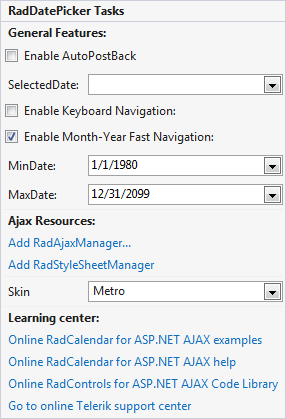

# Smart Tag

The **Smart Tag** allows easy access to frequently needed tasks. You can display it by right clicking on a control in the design window, and choosing **Show Smart Tag** from its context menu.

## RadDatePicker

The **RadDatePicker** Smart Tag contains the same **Ajax Resources**, **Skin**, and **Learning Center** sections as the **RadCalendar** control. In addition, the **RadDatePicker** Smart Tag lets you do the following:

### RadDatePicker Tasks

* **Enable AutoPostBack** - lets you enable or disable postbacks when the user selects a date using the **RadDatePicker** input area or popup calendar.

* **SelectedDate** - lets you initialize the value of the **RadDatePicker** control to a date you select from a popup calendar.

* **Enable Keyboard Navigation** - toggles support for Access Keys and navigation using the tab keys or arrow keys.

* **Enable Month-Year Fast Navigation** - enables or disables the month/year popup which appears when the user clicks the title area of the title bar. It allows the user to change the current view by selecting a specific month and year, or to move to the view that contains the current date.

* **MinDate** and **MaxDate** - specify the range of valid dates that the user can enter into the **RadDatePicker** control.

