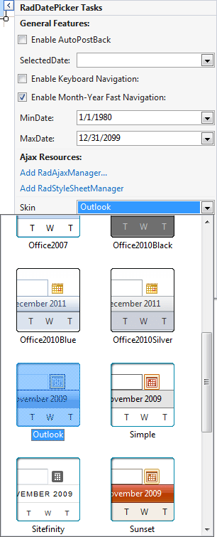
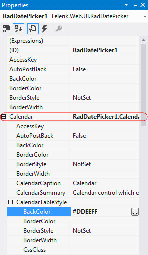
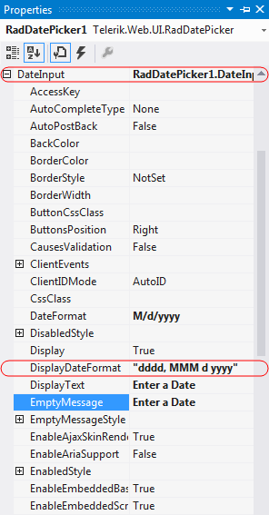
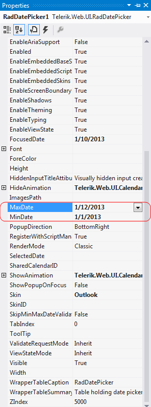
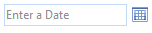

# Getting Started Overview

This tutorial will walk you through creating a Web page that uses **RadDatePicker** controls. It shows how to:

* Apply skins to change the overall look and feel of the control

* Apply styles to tweak the appearance of the controls

* Add messages to appear when nothing is entered in the **RadDatePicker** control

* Specify formats for display and editing.

## Adding a RadDatePicker control

1. Drag a **RadDatePicker** control from the toolbox onto your Web Page.

2. In the **RadDatePicker** [Smart Tag]() that appears automatically, choose "Outlook" from the drop-down list for the **Skin** property:

3. In the properties pane for the **RadDatePicker** control, locate the **Calendar** property. This lets you configure the embedded **RadCalendar** control that acts as a popup. Locate its **CalendarTableStyle** property and set the**BackColor** to **#DDEEFF** to match the **RadCalendar** control you added earlier.

4. Also under the **Calendar** property, set the **ShowOtherMonthDays** property to **False**, so that the appearance matches the other **RadCalendar** control on the page.

5. Locate the **DateInput** property. This lets you configure the embedded **RadDateInput** control. Change the following properties for the embedded **RadDateInput** control:
    * Set the value of the **DisplayDateFormat** property to "dddd, MMM d, yyyy".This tells the **RadDateInput** control how to format its value when it does not have input focus(when the user is not editing its value.)
    * Set the **EmptyMessage** property to " Enter a Date ". This tells the**RadDateInput** control to display the specified prompt when its value has not been set.
    
    
    
6. Set the **MinDate** and **MaxDate** properties to specify the range of valid dates that the user can enter into the **RadDatePicker** control**.

## Running the application

1. Run the application. When it first starts up, the **RadDatePicker** control shows an empty message, because no value has been assigned yet. The control appears in the "Outlook" skin. 

4. Scroll the popup calendar on the **RadDatePicker** control using the navigation controls in its title bar. Note that you cannot navigate before the minimum date you have specified or after the maximum date.

5. Select a date and time value for the control. Note the formatting changes depending on whether the control has focus.

# See Also

 * [RadCalendar Structure]()

 * [RadDatePicker Structure]()

