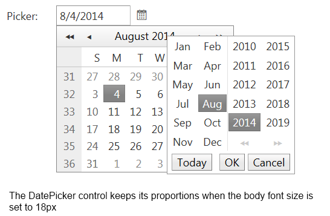

# Fluid and Elastic Capabilities


The **RadDatePicker** control provides elastic and fluid capabilities which allow keeping the control’s component proportion on different mobile devices.

## Fluid capability

The **fluid** capabilities are simply achievable by setting the control’s width in **percentage**.

## Elastic capability

To take advantage **elastic** functionality you should set a specific **font size** based on the application target **mobile device** and follow three simple steps to make the **RadDatePicker** control **elastic**:

1. By using CSS selectors apply "**1em**" font size for all the **Calendar** components like this:
````ASPNET
<style type="text/css">
    /*Calednar*/ html .RadCalendar,
    /*MonthYearPicker, RadDatePicker FastNavigation Popup*/ html .RadCalendarMonthView,
    /*TimeView Popup*/ html .RadCalendarTimeView,
    /*Input, DateInput*/ html .RadInput, html .riTextBox,
    html .RadPicker {
        font-size: 1em;
    }
</style>
````


2. Set the **RenderMode** property of the **DatePicker** control to "**Lightweight**"
````ASPNET
<telerik:RadDatePicker ID="RadDatePicker2" runat="server" SelectedDate="8.4.2014" RenderMode="Lightweight" Width="13.3333em" DateInput-Label="Label:">
</telerik:RadDatePicker>
````


3. Set the RadDatePicker **width** in "**em**". In order to keep the default pickers **proportion** on mobile devices we suggest that you to set **width="13.3333em"** as the default width of the components is "**160px**" and the font-size is originally set to "**12px**"See the both images bellow that presents the control's **elastic** capability

	* DatePicker control's rendering in case the body font size is set to 12px
	

	* DatePicker control's rendering in case the body font size is set to 18px
	
    
    

