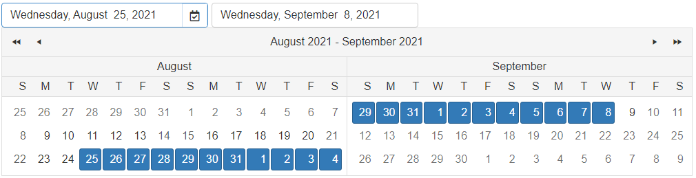

# Customizing the Embedded Controls

The **RadDateRangePicker** control is a composite object, containing two embedded **RadDatePicker** controls (StartDatePicker and EndDatePicker) and a **RadCalendar** control. All of these embedded controls can be customized, just as you can customize a standalone **RadDatePicker** or **RadCalendar** control.
 
To customize the embedded controls, you can use the corresponding inner tags in the declaration, or use the dedicated properties in the code-behind.

Modifying the settings of a child control provides greater flexibility when configuring the look and feel of the **RadDateRangePicker** control – you have complete control over the settings of the embedded controls.

With that said, you can:

 - Set options for minimum and maximum allowed dates by setting the [RangeMinDate](https://docs.telerik.com/devtools/aspnet-ajax/api/server/Telerik.Web.UI/RadCalendar#rangemindate) and [RangeMaxDate](https://docs.telerik.com/devtools/aspnet-ajax/api/server/Telerik.Web.UI/RadCalendar#rangemaxdate)

 - Define the visible amount of months by setting the `MultiViewRows` and `MultiViewColumns` properties, refer to [RadCalendar Multi-View Mode](https://docs.telerik.com/devtools/aspnet-ajax/controls/calendar/functionality/multi-view-mode) 

 - Configure the Dates' settings as shown in [RadCalendar Dates Configuration](https://docs.telerik.com/devtools/aspnet-ajax/controls/calendar/functionality/dates-configuration)

 - Set desired date format in the pickers like shown in [RadDatePicker Formatting Values](https://docs.telerik.com/devtools/aspnet-ajax/controls/datepicker/functionality/formatting-values)

 - etc.

>note RadDatePicker is a composite control as well, so you can go deeper and customize its embedded DateInput and PopUpButton as described in the [RadDatePicker's documentation](https://docs.telerik.com/devtools/aspnet-ajax/controls/datepicker/functionality/customizing-embedded-controls)

Check out the sample below:



````ASPX
<telerik:RadDateRangePicker runat="server" ID="RadDateRangePicker1" Skin="Bootstrap" Width="800">
    <Calendar CellAlign="Center"
        RangeMinDate="8/8/2021"
        RangeMaxDate="9/9/2021"
        CellVAlign="Middle"
        DayNameFormat="FirstLetter"
        FirstDayOfWeek="Default"
        MonthLayout="Layout_14columns_x_3rows"
        Orientation="RenderInRows"
        TitleAlign="Center"
        UseColumnHeadersAsSelectors="False"
        ShowRowHeaders="False">
    </Calendar>
    <StartDatePicker Width="300">
        <DatePopupButton
            Visible="true"
            CssClass="startPopupCustomIcon"
            BorderColor="#D0E1F2"
            BorderStyle="Solid"
            BorderWidth="1px" />
        <DateInput DateFormat="MMM d  yyyy"
            DisplayDateFormat="dddd, MMMM  d, yyyy">
        </DateInput>
    </StartDatePicker>
    <EndDatePicker Width="300">
        <DateInput DateFormat="MMM d  yyyy"
            DisplayDateFormat="dddd, MMMM  d, yyyy">
        </DateInput>
    </EndDatePicker>
</telerik:RadDateRangePicker>
````
````CSS
html body .RadDateRangePicker .startPopupCustomIcon:before {
    font-family: "Font Awesome 5 Free";
    content: "\f274";
}
````

>note In the sample above, the DatePopUpButton contains a third-party font icon that requires a reference to an external library. Find out how to replace the embedded font icons of Telerik controls with external ones in the [4 Ways to Embed Font Awesome in Telerik UI for ASP.NET AJAX Controls](https://www.telerik.com/blogs/4-ways-embed-font-awesome-telerik-ui-for-asp-dotnet-ajax) blog post.


# See Also

 * [RadDateRangePicker Structure](#structure)

 * [RadDatePicker Structure]()

 * [Using shared RadCalendar]()

 * [Formatting Values]()


