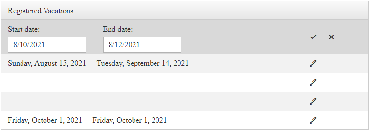

# Data Binding 


Binding a **RadDateRangePicker** control to a data source is easy by using the **DbRangeSelectionStartDate** and **DbRangeSelectionEndDate** properties exposed by the component. It works almost like the **RangeSelectionStartDate** and **RangeSelectionEndDate** one, but these do not throw an exception when given a null value.

When embedding a **RadDateRangePicker** control inside a data-bound control, use a data-binding expression to bind the value of the input control to the data source of the parent control. Data-binding expressions are contained within *<%# and %>* delimiters and use the **Eval** and **Bind** functions. The **Eval** function is used to define one-way (read-only) binding. The **Bind** function is used for two-way (updatable) binding.

>note 
In addition to calling **Eval** and **Bind** methods to perform data binding in a data-binding expression, you can call any publicly scoped code within the *<%# and %>* delimiters to execute that code and return a value during page processing.
>




The following example demonstrates how to bind a **RadDateRangePicker** control inside a RadGrid, as shown above.

````ASPX
<telerik:RadGrid RenderMode="Lightweight" ID="RadGrid1" runat="server" AutoGenerateColumns="False"
    OnNeedDataSource="RadGrid1_NeedDataSource" OnUpdateCommand="RadGrid1_UpdateCommand">
    <MasterTableView EditMode="InPlace">
        <Columns>
            <telerik:GridTemplateColumn HeaderText="Registered Vacations" UniqueName="TemplateColumn">
                <ItemTemplate>
                    <asp:Label runat="server" ID="startDate" Text='<%# Eval("StartDate", "{0:D}") %>'>
                    </asp:Label>
                    &nbsp;-&nbsp;
                    <asp:Label runat="server" ID="endDate" Text='<%# Eval("EndDate", "{0:D}") %>'>
                    </asp:Label>
                </ItemTemplate>
                <EditItemTemplate>
                    <telerik:RadDateRangePicker ID="RadDateRangePicker1" CssClass="RadDateRangePicker" runat="server" DbSelectedStartDate='<%# Bind("StartDate") %>' DbSelectedEndDate='<%# Bind("EndDate") %>'>
                        <StartDatePicker>
                            <DateInput Label="Start date: "></DateInput>
                        </StartDatePicker>
                        <EndDatePicker>
                            <DateInput Label="End date: "></DateInput>
                        </EndDatePicker>
                    </telerik:RadDateRangePicker>
                </EditItemTemplate>
            </telerik:GridTemplateColumn>
            <telerik:GridEditCommandColumn UniqueName="EditColumn">
            </telerik:GridEditCommandColumn>
        </Columns>
    </MasterTableView>
</telerik:RadGrid>
````
````C#
private void Page_Load(object sender, System.EventArgs e)
{
    if (!Page.IsPostBack)
    {
        RadGrid1.EditIndexes.Add(0);
    }
}

private DataTable DataSource1
{
    get
    {
        if (Session[Request.CurrentExecutionFilePath + "Events"] == null)
        {
            DataTable table = new DataTable("Events");

            table.Columns.Add(new DataColumn { ColumnName = "StartDate", DataType = typeof(System.DateTime) });
            table.Columns.Add(new DataColumn { ColumnName = "EndDate", DataType = typeof(System.DateTime) });

            table.Rows.Add(new object[] { new DateTime(2021, 8, 10), new DateTime(2021, 8, 12) });
            table.Rows.Add(new object[] { new DateTime(2021, 8, 15), new DateTime(2021, 9, 14) });
            table.Rows.Add(new object[] { null });
            table.Rows.Add(new object[] { System.DBNull.Value });
            table.Rows.Add(new object[] { new DateTime(2021, 10, 1), new DateTime(2021, 10, 1) });

            Session[Request.CurrentExecutionFilePath + "Events"] = table;
        }

        return (DataTable)Session[Request.CurrentExecutionFilePath + "Events"];
    }
}

protected void RadGrid1_NeedDataSource(object source, GridNeedDataSourceEventArgs e)
{
    RadGrid1.DataSource = DataSource1;
}

protected void RadGrid1_UpdateCommand(object source, GridCommandEventArgs e)
{
    RadDateRangePicker picker = (RadDateRangePicker)e.Item.FindControl("RadDateRangePicker1");

    object startDate = picker.DbSelectedStartDate;
    object endDate = picker.DbSelectedEndDate;

    DataSource1.Rows[e.Item.DataSetIndex]["StartDate"] = startDate == null ? DBNull.Value : startDate;
    DataSource1.Rows[e.Item.DataSetIndex]["EndDate"] = endDate == null ? DBNull.Value : endDate;
}
````
````VB
Private Sub Page_Load(ByVal sender As Object, ByVal e As System.EventArgs) Handles Me.Load
    If Not Page.IsPostBack Then
        RadGrid1.EditIndexes.Add(0)
    End If
End Sub

Private ReadOnly Property DataSource1 As DataTable
    Get

        If Session(Request.CurrentExecutionFilePath & "Events") Is Nothing Then
            Dim table As DataTable = New DataTable("Events")
            table.Columns.Add(New DataColumn With {
            .ColumnName = "StartDate",
            .DataType = GetType(System.DateTime)
        })
            table.Columns.Add(New DataColumn With {
            .ColumnName = "EndDate",
            .DataType = GetType(System.DateTime)
        })
            table.Rows.Add(New Object() {New DateTime(2021, 8, 10), New DateTime(2021, 8, 12)})
            table.Rows.Add(New Object() {New DateTime(2021, 8, 15), New DateTime(2021, 9, 14)})
            table.Rows.Add(New Object() {Nothing})
            table.Rows.Add(New Object() {System.DBNull.Value})
            table.Rows.Add(New Object() {New DateTime(2021, 10, 1), New DateTime(2021, 10, 1)})
            Session(Request.CurrentExecutionFilePath & "Events") = table
        End If

        Return CType(Session(Request.CurrentExecutionFilePath & "Events"), DataTable)
    End Get
End Property

Protected Sub RadGrid1_NeedDataSource(ByVal source As Object, ByVal e As GridNeedDataSourceEventArgs)
    RadGrid1.DataSource = DataSource1
End Sub

Protected Sub RadGrid1_UpdateCommand(ByVal source As Object, ByVal e As GridCommandEventArgs)
    Dim picker As RadDateRangePicker = CType(e.Item.FindControl("RadDateRangePicker1"), RadDateRangePicker)
    Dim startDate As Object = picker.DbSelectedStartDate
    Dim endDate As Object = picker.DbSelectedEndDate
    DataSource1.Rows(e.Item.DataSetIndex)("StartDate") = If(startDate Is Nothing, DBNull.Value, startDate)
    DataSource1.Rows(e.Item.DataSetIndex)("EndDate") = If(endDate Is Nothing, DBNull.Value, endDate)
End Sub
````


To see the live example that the example above was taken from, see [Data Binding](https://demos.telerik.com/aspnet-ajax/daterangepicker/functionality/databinding/defaultcs.aspx).


