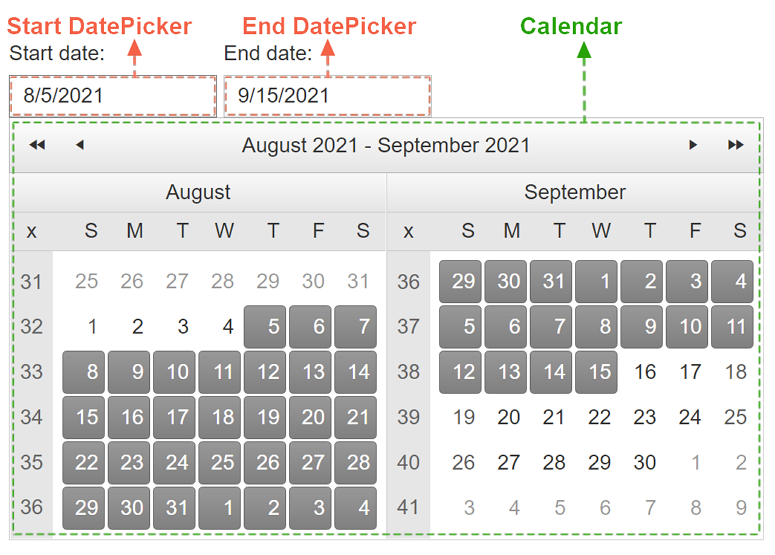

# Getting Started 

The following article shows the structure and demonstrates how you can add the RadDateRangePicker control and customize it by setting some of its properties.

## Structure

The structure of the **RadDateRangePicker** control is as follows:



The rich functionality of the built-in RadCalendar and DatePicker(s) determine the flexibility of the RadDateRangePicker itself. You can use the corresponding inner tags to set the properties of the Calendar and pickers in any desired manner as shown below:

````ASP.NET
<telerik:RadDateRangePicker runat="server" ID="RadDateRangePicker1" Skin="Material" Width="800">
    <Calendar FirstDayOfWeek="Monday">
    </Calendar>
    <StartDatePicker Width="300">
        <DateInput Label="Start date: " DisplayDateFormat="dddd, MMMM  d, yyyy"></DateInput>
    </StartDatePicker>
    <EndDatePicker Width="300">
        <DateInput Label="End date: " DisplayDateFormat="dddd, MMMM  d, yyyy"></DateInput>
    </EndDatePicker>
</telerik:RadDateRangePicker>
````

To find more on how to customize the embedded controls, check out the [Customizing the Embedded Controls]() article and the the dedicated documentation sections of the embedded components:

 - [RadCalendar Overview]()

 - [RadDatePicker Overview]()

For the intuitive behavior of a simply declared RadDateRangePicker, we have changed some of the default values in its embedded controls: 

>caption Calendar

| Property           | Default value in **RadDateRangePicker** | Default value in **RadCalendar** |
|--------------------|-------------------------------------|------------------------------|
| `RangeSelectionMode` | ConsecutiveClicks                   | None                         |
| `MultiViewColumns`   | 2                                   | 1                            |

>caption DatePicker(s)

| Property                | Default value in **RadDateRangePicker** | Default value in **RadDatePicker** |
|-------------------------|-------------------------------------|--------------------------------|
| `DatePopupButton-Visible` | False                               | True                           |
| `ShowPopupOnFocus`        | True                                | False                          |

>note
For the proper functioning of the RadDateRangePicker, some features of the embedded Calendar and DatePickers are disabled.

## Add a RadDateRangePicker Control

1. Add a **ScriptManager** control on a Web Form.

1. Use the **&lt;telerik:RadDateRangePicker&gt;** tag to declare the RadDateRangePicker.

1. Set the desired properties of the DateRangePickers and its embedded controls: Calendar, StartDatePicker, EndDatePicker:

````ASP.NET
<asp:ScriptManager ID="ScriptManager1" runat="server"></asp:ScriptManager>

<telerik:RadDateRangePicker runat="server" ID="RadDateRangePicker1">
    <Calendar RangeSelectionMode="ConsecutiveClicks" MultiViewColumns="2" MultiViewRows="1">
    </Calendar>
    <StartDatePicker>
        <DateInput Label="Start date: "></DateInput>
    </StartDatePicker>
    <EndDatePicker>
        <DateInput Label="End date: "></DateInput>
    </EndDatePicker>
</telerik:RadDateRangePicker>
````

As a next step, you can check out the [Functionality]() of the RadDateRangePicker.

# See Also
 * [Server-side Programming]()
 * [First Steps with UI for ASP.NET AJAX]()
 * [RadDateRangePicker online demos](https://demos.telerik.com/aspnet-ajax/daterangepicker/examples/overview/defaultcs.aspx)


