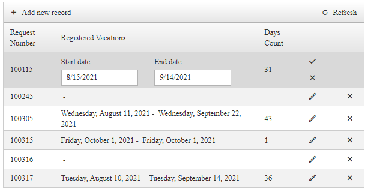

# How to Integrate RadDateRangePicker in RadGrid control

This article explains how to use RadDateRangePicker in the RadGrid component.

>caption Figure 1:



Here is one option to use RadDateRangePicker to show and edit date ranges inside a GridTemplateColumn:

 1. Declare a RadDateRangePicker inside the EditTemplate of a GridTemplateColumn and use its DbRangeSelectionStartDate and DbRangeSelectionEndDate properties for binding to the Grid's DataSource fields (*StartDate* and *EndDate* are the data field names used in the sample below):

 ````ASP.NET
 <EditItemTemplate>
    <telerik:RadDateRangePicker ID="RadDateRangePicker1" CssClass="RadDateRangePicker" runat="server"
        DbRangeSelectionStartDate='<%# Bind("StartDate") %>'
        DbRangeSelectionEndDate='<%# Bind("EndDate") %>'>
        <StartDatePicker>
            <DateInput Label="Start date: "></DateInput>
        </StartDatePicker>
        <EndDatePicker>
            <DateInput Label="End date: "></DateInput>
        </EndDatePicker>
    </telerik:RadDateRangePicker>
</EditItemTemplate>
````

 2. In the Item Template you can use Labels to visualize the current DateRange:

 ````ASP.NET
 <ItemTemplate>
    <asp:Label runat="server" ID="startDate" Text='<%# Eval("StartDate", "{0:D}") %>'>
    </asp:Label>
    &nbsp;-&nbsp;
    <asp:Label runat="server" ID="endDate" Text='<%# Eval("EndDate", "{0:D}") %>'>
    </asp:Label>
</ItemTemplate>
 ````

## Example

Check out the complete sample with RadGrid's Manual CRUD Operations below:

````ASP.NET(C#)
<telerik:RadGrid RenderMode="Lightweight" ID="RadGrid1" runat="server" AutoGenerateColumns="False" Width="750"
    OnNeedDataSource="RadGrid1_NeedDataSource"
    OnUpdateCommand="RadGrid1_UpdateCommand"
    OnInsertCommand="RadGrid1_InsertCommand"
    OnDeleteCommand="RadGrid1_DeleteCommand">
    <MasterTableView EditMode="InPlace" DataKeyNames="Id" CommandItemDisplay="Top">
        <Columns>
            <telerik:GridBoundColumn UniqueName="Id" ReadOnly="true" Visible="true" HeaderText="Request Number" DataField="Id"></telerik:GridBoundColumn>
            <telerik:GridTemplateColumn HeaderText="Registered Vacations" UniqueName="TemplateColumn">
                <ItemTemplate>
                    <asp:Label runat="server" ID="startDate" Text='<%# Eval("StartDate", "{0:D}") %>'>
                    </asp:Label>&nbsp;-&nbsp;
                    <asp:Label runat="server" ID="endDate" Text='<%# Eval("EndDate", "{0:D}") %>'>
                    </asp:Label>
                </ItemTemplate>
                <EditItemTemplate>
                    <telerik:RadDateRangePicker ID="RadDateRangePicker1" CssClass="RadDateRangePicker" runat="server"
                        DbRangeSelectionStartDate='<%# Bind("StartDate") %>'
                        DbRangeSelectionEndDate='<%# Bind("EndDate") %>'>
                        <StartDatePicker>
                            <DateInput Label="Start date: "></DateInput>
                        </StartDatePicker>
                        <EndDatePicker>
                            <DateInput Label="End date: "></DateInput>
                        </EndDatePicker>
                    </telerik:RadDateRangePicker>
                </EditItemTemplate>
            </telerik:GridTemplateColumn>
            <telerik:GridTemplateColumn UniqueName="DaysOffCount" HeaderText="Days Count" ReadOnly="true">
                <ItemTemplate>
                    <asp:Label runat="server" ID="Label1" Text='<%# (Eval("EndDate") != DBNull.Value && Eval("StartDate") != DBNull.Value) ? ((Convert.ToDateTime(Eval("EndDate")) - Convert.ToDateTime(Eval("StartDate"))).Days+1).ToString() : "" %>'></asp:Label>
                </ItemTemplate>
            </telerik:GridTemplateColumn>
            <telerik:GridEditCommandColumn UniqueName="EditColumn"></telerik:GridEditCommandColumn>
            <telerik:GridClientDeleteColumn UniqueName="DeleteColumn"></telerik:GridClientDeleteColumn>
        </Columns>
    </MasterTableView>
</telerik:RadGrid>
````
````ASP.NET(VB)
<telerik:RadGrid RenderMode="Lightweight" ID="RadGrid1" runat="server" AutoGenerateColumns="False" Width="750"
    OnNeedDataSource="RadGrid1_NeedDataSource"
    OnUpdateCommand="RadGrid1_UpdateCommand"
    OnInsertCommand="RadGrid1_InsertCommand"
    OnDeleteCommand="RadGrid1_DeleteCommand">
    <MasterTableView EditMode="InPlace" DataKeyNames="Id" CommandItemDisplay="Top">
        <Columns>
            <telerik:GridBoundColumn UniqueName="Id" ReadOnly="true" Visible="true" HeaderText="Request Number" DataField="Id"></telerik:GridBoundColumn>
            <telerik:GridTemplateColumn HeaderText="Registered Vacations" UniqueName="TemplateColumn">
                <ItemTemplate>
                    <asp:Label runat="server" ID="startDate" Text='<%# Eval("StartDate", "{0:D}") %>'>
                    </asp:Label>&nbsp;-&nbsp;
                    <asp:Label runat="server" ID="endDate" Text='<%# Eval("EndDate", "{0:D}") %>'>
                    </asp:Label>
                </ItemTemplate>
                <EditItemTemplate>
                    <telerik:RadDateRangePicker ID="RadDateRangePicker1" CssClass="RadDateRangePicker" runat="server"
                        DbRangeSelectionStartDate='<%# Bind("StartDate") %>'
                        DbRangeSelectionEndDate='<%# Bind("EndDate") %>'>
                        <StartDatePicker>
                            <DateInput Label="Start date: "></DateInput>
                        </StartDatePicker>
                        <EndDatePicker>
                            <DateInput Label="End date: "></DateInput>
                        </EndDatePicker>
                    </telerik:RadDateRangePicker>
                </EditItemTemplate>
            </telerik:GridTemplateColumn>
            <telerik:GridTemplateColumn UniqueName="DaysOffCount" HeaderText="Days Count" ReadOnly="true">
                <ItemTemplate>
                    <asp:Label runat="server" ID="Label1" Text='<%# If((Eval("EndDate") IsNot DBNull.Value AndAlso Eval("StartDate") IsNot DBNull.Value), ((Convert.ToDateTime(Eval("EndDate")) - Convert.ToDateTime(Eval("StartDate"))).Days + 1).ToString(), "") %>'></asp:Label>
                </ItemTemplate>
            </telerik:GridTemplateColumn>
            <telerik:GridEditCommandColumn UniqueName="EditColumn"></telerik:GridEditCommandColumn>
            <telerik:GridClientDeleteColumn UniqueName="DeleteColumn"></telerik:GridClientDeleteColumn>
        </Columns>
    </MasterTableView>
</telerik:RadGrid>
````

````C#
private DataTable DataSource1
{
    get
    {
        if (Session[Request.CurrentExecutionFilePath + "Events"] == null)
        {
            DataTable table = new DataTable("Events");

            table.Columns.Add(new DataColumn { ColumnName = "Id", DataType = typeof(int) });
            table.Columns.Add(new DataColumn { ColumnName = "StartDate", DataType = typeof(System.DateTime) });
            table.Columns.Add(new DataColumn { ColumnName = "EndDate", DataType = typeof(System.DateTime) });

            table.PrimaryKey = new DataColumn[] { table.Columns["Id"] };

            table.Rows.Add(new object[] { 100045, new DateTime(2021, 8, 8), new DateTime(2021, 8, 12) });
            table.Rows.Add(new object[] { 100115, new DateTime(2021, 8, 15), new DateTime(2021, 9, 14) });
            table.Rows.Add(new object[] { 100245, null });
            table.Rows.Add(new object[] { 100305, System.DBNull.Value});
            table.Rows.Add(new object[] { 100315, new DateTime(2021, 10, 1), new DateTime(2021, 10, 1) });

            Session[Request.CurrentExecutionFilePath + "Events"] = table;
        }

        return (DataTable)Session[Request.CurrentExecutionFilePath + "Events"];
    }
}

private void Page_Load(object sender, System.EventArgs e)
{
    if (!Page.IsPostBack)
    {
        Session.Remove(Request.CurrentExecutionFilePath + "Events");
    }
}

//Read
protected void RadGrid1_NeedDataSource(object source, GridNeedDataSourceEventArgs e)
{
    RadGrid1.DataSource = DataSource1;
}

//Update
protected void RadGrid1_UpdateCommand(object source, GridCommandEventArgs e)
{
    RadDateRangePicker picker = (RadDateRangePicker)e.Item.FindControl("RadDateRangePicker1");

    object startDate = picker.DbRangeSelectionStartDate;
    object endDate = picker.DbRangeSelectionEndDate;

    DataSource1.Rows[e.Item.DataSetIndex]["StartDate"] = startDate == null ? DBNull.Value : startDate;
    DataSource1.Rows[e.Item.DataSetIndex]["EndDate"] = endDate == null ? DBNull.Value : endDate;
}

//Insert
protected void RadGrid1_InsertCommand(object sender, GridCommandEventArgs e)
{
    GridEditableItem editedItem = e.Item as GridEditableItem;

    DataRow newRow = DataSource1.NewRow();
    DataRow[] allValues = DataSource1.Select("Id = MAX(Id)");
    if (allValues.Length > 0)
    {
        newRow["Id"] = int.Parse(allValues[0]["Id"].ToString()) + 1;
    }
    else
    {
        newRow["Id"] = 100001; //the table is empty;
    }

    Hashtable newValues = new Hashtable();
    //The GridTableView will fill the values from all editable columns in the hash
    e.Item.OwnerTableView.ExtractValuesFromItem(newValues, editedItem);
        
    newRow["StartDate"] = newValues["StartDate"] == null ? DBNull.Value : newValues["StartDate"];
    newRow["EndDate"] = newValues["EndDate"] == null ? DBNull.Value : newValues["EndDate"];
       
    DataSource1.Rows.Add(newRow);
}

//Delete
protected void RadGrid1_DeleteCommand(object sender, GridCommandEventArgs e)
{
    GridDataItem dataItem = e.Item as GridDataItem;
    string ID = dataItem.GetDataKeyValue("Id").ToString();

    if (DataSource1.Rows.Find(ID) != null)
    {
        DataSource1.Rows.Find(ID).Delete();
    }
}
````
````VB
Private ReadOnly Property DataSource1 As DataTable
    Get

        If Session(Request.CurrentExecutionFilePath & "Events") Is Nothing Then
            Dim table As DataTable = New DataTable("Events")
            table.Columns.Add(New DataColumn With {
                .ColumnName = "Id",
                .DataType = GetType(Integer)
            })
            table.Columns.Add(New DataColumn With {
                .ColumnName = "StartDate",
                .DataType = GetType(System.DateTime)
            })
            table.Columns.Add(New DataColumn With {
                .ColumnName = "EndDate",
                .DataType = GetType(System.DateTime)
            })
            table.PrimaryKey = New DataColumn() {table.Columns("Id")}
            table.Rows.Add(New Object() {100045, New DateTime(2021, 8, 8), New DateTime(2021, 8, 12)})
            table.Rows.Add(New Object() {100115, New DateTime(2021, 8, 15), New DateTime(2021, 9, 14)})
            table.Rows.Add(New Object() {100245, Nothing})
            table.Rows.Add(New Object() {100305, System.DBNull.Value})
            table.Rows.Add(New Object() {100315, New DateTime(2021, 10, 1), New DateTime(2021, 10, 1)})
            Session(Request.CurrentExecutionFilePath & "Events") = table
        End If

        Return CType(Session(Request.CurrentExecutionFilePath & "Events"), DataTable)
    End Get
End Property

Private Sub Page_Load(ByVal sender As Object, ByVal e As System.EventArgs)
    If Not Page.IsPostBack Then
        Session.Remove(Request.CurrentExecutionFilePath & "Events")
    End If
End Sub

Protected Sub RadGrid1_NeedDataSource(ByVal source As Object, ByVal e As GridNeedDataSourceEventArgs)
    RadGrid1.DataSource = DataSource1
End Sub

Protected Sub RadGrid1_UpdateCommand(ByVal source As Object, ByVal e As GridCommandEventArgs)
    Dim picker As RadDateRangePicker = CType(e.Item.FindControl("RadDateRangePicker1"), RadDateRangePicker)
    Dim startDate As Object = picker.DbRangeSelectionStartDate
    Dim endDate As Object = picker.DbRangeSelectionEndDate
    DataSource1.Rows(e.Item.DataSetIndex)("StartDate") = If(startDate Is Nothing, DBNull.Value, startDate)
    DataSource1.Rows(e.Item.DataSetIndex)("EndDate") = If(endDate Is Nothing, DBNull.Value, endDate)
End Sub

Protected Sub RadGrid1_InsertCommand(ByVal sender As Object, ByVal e As GridCommandEventArgs)
    Dim editedItem As GridEditableItem = TryCast(e.Item, GridEditableItem)
    Dim newRow As DataRow = DataSource1.NewRow()
    Dim allValues As DataRow() = DataSource1.[Select]("Id = MAX(Id)")

    If allValues.Length > 0 Then
        newRow("Id") = Integer.Parse(allValues(0)("Id").ToString()) + 1
    Else
        newRow("Id") = 100001
    End If

    Dim newValues As Hashtable = New Hashtable()
    e.Item.OwnerTableView.ExtractValuesFromItem(newValues, editedItem)
    newRow("StartDate") = If(newValues("StartDate") Is Nothing, DBNull.Value, newValues("StartDate"))
    newRow("EndDate") = If(newValues("EndDate") Is Nothing, DBNull.Value, newValues("EndDate"))
    DataSource1.Rows.Add(newRow)
End Sub

Protected Sub RadGrid1_DeleteCommand(ByVal sender As Object, ByVal e As GridCommandEventArgs)
    Dim dataItem As GridDataItem = TryCast(e.Item, GridDataItem)
    Dim ID As String = dataItem.GetDataKeyValue("Id").ToString()

    If DataSource1.Rows.Find(ID) IsNot Nothing Then
        DataSource1.Rows.Find(ID).Delete()
    End If
End Sub
````

Check out a live example in our [Data-Binding demo](https://demos.telerik.com/aspnet-ajax/daterangepicker/functionality/databinding/defaultcs.aspx). 

 
# See Also

 * [Data-Binding demo](https://demos.telerik.com/aspnet-ajax/daterangepicker/functionality/databinding/defaultcs.aspx)

 * [RadGrid Manual CRUD Operations](https://demos.telerik.com/aspnet-ajax/grid/examples/data-editing/manual-crud-operations/defaultcs.aspx)

