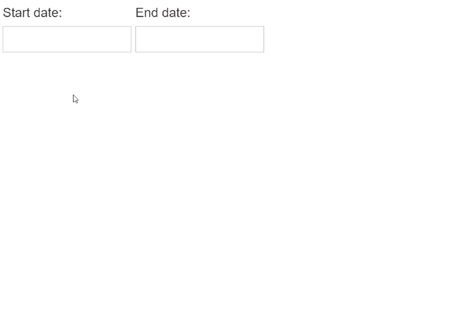

# RadDateRangePicker Overview

The DateRangePicker control enables you to effortlessly select a range of dates, which makes the component perfect for any booking scenarios such as travel and medicine sites.

The RadDateRangePicker is a composite control combining two RadDatePicker controls and a shared MultiView RadCalendar

## Key Features

* [Built-in Accessibility, WAI-ARIA and RTL support]()
* [Date Range Selection]()
* [Data Binding]()
* [Customize Embedded Controls]()
* [Flexible Client-Side API]()
* [Visual Appeal - shipped with a rich set of skins for easy and consistent styling](#skins)

## Appearance and styling

The RadDateRangePicker uses skins to control the overall look-and-feel of the component. A skin is a set of images and a CSS stylesheet that can be applied to the control elements (date cells, buttons, etc.) and defines their look and feel. To apply a skin to a RadDateRangePicker control, set its Skin property, either using the properties pane or the control's Smart Tag.

On RadDateRangePicker, the Skin property value is always propagated to the child controls (the embedded RadDatePicker controls and popup RadCalendar).

<video autoplay muted loop>
  <source src="images/daterangepicker-skins.mp4" type="video/mp4" />
  Video tag is not supported.
</video>

For more information on how you can customize the appearance, please refer to the RadCalendar and RadDatePicker *Appearance and styling* sections:

 - [Controlling appearance of RadDatePicker]()

 - [Controlling appearance of RadCalendar]()

# See Also

 * [Getting Started]()
 * [DateRangePicker online demos](https://demos.telerik.com/aspnet-ajax/daterangepicker/examples/overview/defaultcs.aspx)
 * [First Steps with UI for ASP.NET AJAX]() 

