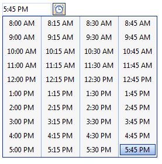

# Configuring the Embedded Time View


By default, the embedded **RadTimeView** control that the **RadDateTimePicker** control displays as a popup has a header area that says "Time Picker", and three columns of times that the user can select. The times range from 12:00 AM through 11:00 PM, with an entry for every hour:


* To change the text of the header, set the **HeaderText** property. If you set **HeaderText** to an empty string, the header does not appear. You can also hide the header by setting the **ShowHeader** property.

* To change the range of times displayed, use the **StartTime** and **EndTime** properties.

* To change the interval between adjacent times in the time view, set the **Interval** property. The valid values are between **StartTime** and **EndTime** and less than **EndTime - StartTime**.

* To change the number of columns, set the **Columns** property.

You can set these properties at design time by expanding the **TimeView** property:

````ASPNET
<telerik:RadDateTimePicker ID="RadDateTimePicker1" runat="server" Skin="Default">
    <TimeView Skin="Default"
        ShowHeader="False"
        StartTime="08:00:00"
        Interval="00:15:00"
        EndTime="18:00:00"
        Columns="4">
    </TimeView>
</telerik:RadDateTimePicker> 
````



## RadDateTimePicker custom values

**RadDateTimePicker** allows displaying custom pre-defined time values. This feature is controlled by the **CustomTimeValues** property that the **TimeView** of the time picker exposes. The **CustomTimeValues** is of type object and accepts:

1. A string array where each string represents a given time value. The separator for the various time parts can be a column, a dash or a semi-column. Each string time value can contains:
	* day, hour, minutes, seconds, milliseconds
	* hour, minutes, seconds, milliseconds
	* hour, minutes, seconds
	* hour, minutes

2. A **TimeSpan** array with the custom-defined time values.

3. A **DateTime** array containing the user-specified time values.

Here is an example how to set the value of the property

Using a string array:


````C#
protected void SetCustomValuesByStringArray()
{
    RadDateTimePicker1.TimeView.CustomTimeValues = new string[] { "12,10,10,57,4", "5,6,3,38,9", "3,8,11,5,7" };
}
````
````VB
Protected Sub SetCustomValuesByStringArray()
    RadDateTimePicker1.TimeView.CustomTimeValues = New String() {"12,10,10,57,4", "5,6,3,38,9", "3,8,11,5,7"}
End Sub
````


Using **TimeSpan** array:


````C#
protected void SetCustomValuesByTimeSpansArray()
{
    RadDateTimePicker1.TimeView.CustomTimeValues = new TimeSpan[] { new TimeSpan(12, 10, 10), new TimeSpan(5, 6, 3), new TimeSpan(3, 8, 11) };
}
````
````VB
Protected Sub SetCustomValuesByTimeSpansArray()
    RadDateTimePicker1.TimeView.CustomTimeValues = New TimeSpan() {New TimeSpan(12, 10, 10), New TimeSpan(5, 6, 3), New TimeSpan(3, 8, 11)}
End Sub
````


Using **DateTime** array:


````C#
protected void SetCustomValuesByDateTimeArray()
{
    RadDateTimePicker1.TimeView.CustomTimeValues = new DateTime[] { new DateTime(2012, 12, 15, 12, 10, 10), new DateTime(2012, 12, 15, 5, 6, 3), new DateTime(2012, 12, 15, 3, 8, 11) };
}
````
````VB
Protected Sub SetCustomValuesByDateTimeArray()
    RadDateTimePicker1.TimeView.CustomTimeValues = New DateTime() {New DateTime(2012, 12, 15, 12, 10, 10), New DateTime(2012, 12, 15, 5, 6, 3), New DateTime(2012, 12, 15, 3, 8, 11)}
End Sub
````


To enable scrolling for the **TimeView** you can set its Width and Height properties:

````ASPNET
<telerik:RadDateTimePicker runat="server" ID="RadDateTimePicker2">
    <TimeView Width="100px" Height="200px" Interval="00:15:00"
    Columns="5"></TimeView>
</telerik:RadDateTimePicker>
````


You can also configure the embedded time view control at runtime:


````C#
protected void Page_Load(object sender, EventArgs e)
{
    if (!IsPostBack)
    {
        RadDateTimePicker1.TimeView.StartTime = new TimeSpan(8, 0, 0);
        RadDateTimePicker1.TimeView.EndTime = new TimeSpan(18, 0, 0);
        RadDateTimePicker1.TimeView.Interval = new TimeSpan(0, 15, 0);
        RadDateTimePicker1.TimeView.HeaderText = "";
        RadDateTimePicker1.TimeView.Columns = 4;
    }
}
````
````VB
Protected Sub Page_Load(ByVal sender As Object, ByVal e As EventArgs) Handles Me.Load
    If Not IsPostBack Then
        RadDateTimePicker1.TimeView.StartTime = New TimeSpan(8, 0, 0)
        RadDateTimePicker1.TimeView.EndTime = New TimeSpan(18, 0, 0)
        RadDateTimePicker1.TimeView.Interval = New TimeSpan(0, 15, 0)
        RadDateTimePicker1.TimeView.HeaderText = ""
        RadDateTimePicker1.TimeView.Columns = 4
    End If
End Sub
````


# See Also

 * [RadTimeView Structure]()

 * [Customizing the Embedded Controls]()

 * [RadTimeView Templates]()
