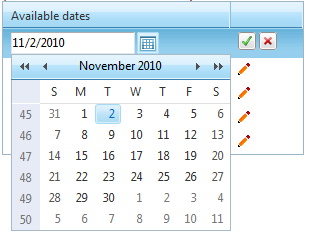

# Data Binding 


Binding a **RadDateTimePicker** control to a data source is easy provided you use the **DbSelectedDate** property. It works almost like the **SelectedDate** one, but does not throw an exception when given a null value.

When embedding a **RadDateTimePicker** control inside a data-bound control, use data-binding expression to bind the value of the input control to the data source of the parent control. Data-binding expressions are contained within *<%# and %>* delimiters and use the **Eval** and **Bind** functions. The **Eval** function is used to define one-way (read-only) binding. The **Bind** function is used for two-way (updatable) binding.

>note 
In addition to calling **Eval** and **Bind** methods to perform data binding in a data-binding expression, you can call any publicly scoped code within the *<%# and %>* delimiters to execute that code and return a value during page processing.
>



The following example demonstrates how to bind a **RadDateTimePicker** control inside a RadGrid.

````ASPNET
<telerik:RadGrid ID="RadGrid1" runat="server" AutoGenerateColumns="False"
    OnNeedDataSource="RadGrid1_NeedDataSource" OnUpdateCommand="RadGrid1_UpdateCommand"
    OnItemCreated="RadGrid1_ItemCreated">
    <MasterTableView EditMode="InPlace">
        <Columns>
            <telerik:GridTemplateColumn HeaderText="Available dates" UniqueName="TemplateColumn1">
                <ItemTemplate>
                    <asp:Label runat="server" ID="date" Text='<%# Eval("Dates") %>'>
                    </asp:Label>&nbsp;
                </ItemTemplate>
                <EditItemTemplate>
                    <telerik:RadDateTimePicker ID="picker1" runat="server" DbSelectedDate='<%# Bind("Dates") %>'
                        Width="180px">
                    </telerik:RadDateTimePicker>
                </EditItemTemplate>
            </telerik:GridTemplateColumn>
        </Columns>
    </MasterTableView>
</telerik:RadGrid>
````


To see the live example that the example above was taken from, see [Data Binding](http://demos.telerik.com/aspnet-ajax/datetimepicker/functionality/data-binding/defaultcs.aspx).


