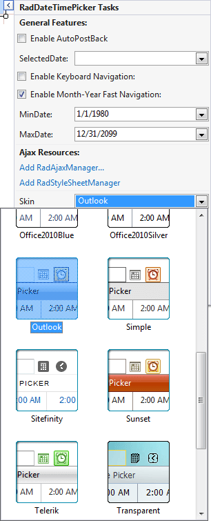
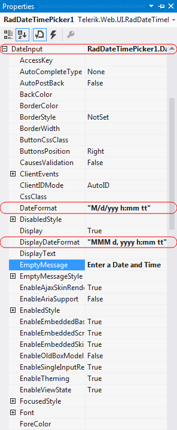
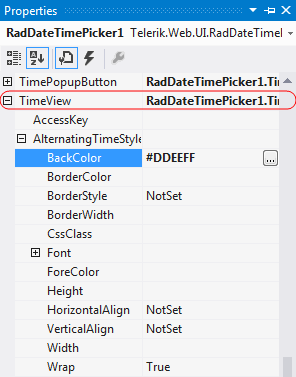
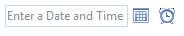

# Getting Started Overview

This tutorial will walk you through creating a Web page that uses **RadCalendar** controls. It shows how to:

* Use a RadDateTimePicker control

* Apply skins to change the overall look and feel of the control

* Apply styles to tweak the appearance of the control

* Configure the selection and navigation behavior of the **RadDateTimePicker** control

* Add messages to appear when nothing is entered in the **RadDateTimePicker**

* Specify formats for display and editing.

## Adding a RadDateTimePicker control

1. Drag a **RadDateTimePicker** control from the toolbox onto your Web Page, below the **RadDatePicker** control.

2. In the properties pane for the **RadDateTimePicker**, set the **Skin** property to "Outlook":

3. In the **Behavior** section of the properties pane, locate the **Calendar** property. As you did with the **RadDatePicker** control, set the **Calendar.CalendarTableStyle.BackColor** property to "#DDEEFF" and the **Calendar. ShowOtherMonthDays** property to **False**.

4. Locate the **DateInput** property. This lets you configure the embedded **RadDateInput** control. Change the following properties for the embedded **RadDateInput** control:
    * Set the value of the **DateFormat** property to "M/d/yyyy h:mm tt". This tells the **RadDateInput** control how to format its value when it has input control (when the user can edit its value).
    * Set the value of the **DisplayDateFormat** property to "MMM d, yyyy h:mm tt". This tells the **RadDateInput** control how to format its value when it does not have input focus (when the user is not editing its value.)
    * Set the **EmptyMessage** property to " Enter a date and time ". This tells the **RadDateInput** control to display the specified prompt when its value has not been set.
    
    

5. Expand the **TimeView** property. This lets you configure the properties of the embedded **RadTimeView** control that acts as a popup for choosing time values. Set its **BackColor** property to "#DDEEFF". This gives it the time selection popup the same background color that we gave the popup **RadCalendar** control.

## Running the application

1. Run the application. When it first starts up, the *RadDateTimePicker** control will show an empty message, because no value has been assigned yet. The picker will be using the "Outlook" skin. 

2. Scroll the popup calendar on the **RadDateTimePicker** control using the navigation controls in its title bar. Note that you cannot navigate before the minimum date you have specified or after the maximum date.

5. Select a date and time value for the control. Note the formatting changes depending on whether the controls have focus.

# See Also

 * [RadDateTimePicker Structure]()
