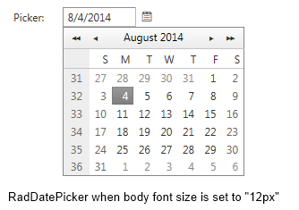
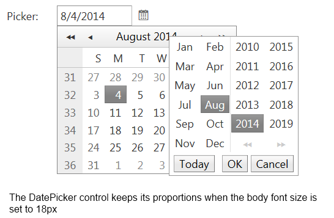

# Fluid and Elastic Capabilities


The **RadDateTimePicker** control provides elastic and fluid capabilities that allow keeping the proportions of the control on different mobile devices.

## Fluid capability

The **fluid** capabilities are simply achievable by setting the width of the control in **percentage**.

## Elastic capability

To use the **elastic** functionality you need to set specific **font size** based on the targeted **mobile device** and follow three simple steps to make the **RadDateTimePicker** **elastic**:

1. By using specific CSS selectors apply "**1em**" font size for all the **Calendar** components like this:
````ASPNET
<style type="text/css">
    /*Calednar*/ html .RadCalendar,
    /*MonthYearPicker, RadDatePicker FastNavigation Popup*/ html .RadCalendarMonthView,
    /*TimeView Popup*/ html .RadCalendarTimeView,
    /*Input, DateInput*/ html .RadInput, html .riTextBox,
    html .RadPicker {
        font-size: 1em;
    }
</style>
````


2. Set the **RenderMode** property of the **RadDateTimePicker** control to "**Lightweight**"
````ASPNET
<telerik:RadDateTimePicker ID="RadDateTimePicker2" runat="server" SelectedDate="4.8.2015 10:00" RenderMode="Lightweight" DateInput-Label="Label:" Width="13.3333em">
</telerik:RadDateTimePicker>
````


3. Set the picker components **width** in "**em**". In order to keep the default calendar/pickers **proportion** on mobile devices we would suggest you to set **width="13.3333em"** as the default width of the components is "**160px**" and the font-size is originally set to "**12px**"See the both images bellow that presents the control's **elastic** capability

	* DatePicker control's rendering in case the body font size is set to 12px
	

	* DatePicker control's rendering in case the body font size is set to 18px
	
