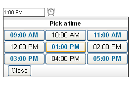

# RadTimeView Templates


The appearance of every aspect of the **RadTimeView** control that is embedded in **RadDateTimePicker** controls can be altered using a template. The way data is rendered is completely determined by your implementation of the control's templates, which describe how to present time items. The **RadTimeView** control supports four types of templates:

* The **TimeTemplate** controls the appearance of the items in the time view that the user can select.

* The **AlternatingTimeTemplate** controls the appearance of every other item in the time view. If an **AlternatingTimeTemplate** is not supplied, the time view uses the **TimeTemplate** (if supplied) for every item in the time view.

* The **HeaderTemplate** controls the appearance of the header section.

* The **FooterTemplate** controls the appearance of the footer section.

## Creating templates at design time

To create templates for the time view control embedded in a **RadDateTimePicker** control, right click on the control and choose **Edit Template** from the **RadDateTimePicker** [Smart Tag](). Select the type of template you want to create, and use the [template design surface]() to create the template. You can drag any controls or HTML elements from the tool box onto the template design surface.

Inside a **TimeTemplate** or **AlternatingTimeTemplate**, you can use a **DataBinder.Eval** statement such as "<%# DataBinder.Eval(Container, "DataItem.Time", "{0:t}")%>" to bind an element to the value the item represents:

The following example illustrates how to add templates at design time to the embedded **RadTimeView** control:

````ASPNET
<telerik:RadDateTimePicker RenderMode="Lightweight" ID="RadDateTimePicker1" runat="server">
    <TimeView
        StartTime="09:00:00"
        EndTime="17:00:10"
        BorderWidth="1px"
        BorderColor="Black" >
        <HeaderTemplate>
            <div style="text-align: center; font-size: 9pt;">
                <b>Pick a time</b>
            </div>
        </HeaderTemplate>
        <TimeTemplate>
            <button style="color: #006699;font-weight:bold;"
             onclick="javascript: return false;">
             <%# DataBinder.Eval(Container, "DataItem.Time","{0:hh:mm tt}") %>
            </button>
        </TimeTemplate>
        <AlternatingTimeTemplate>
            <button onclick="javascript: return false;">
             <%# DataBinder.Eval(Container, "DataItem.Time","{0:hh:mm tt}") %>
            </button>
        </AlternatingTimeTemplate>
        <FooterTemplate>
            <button onclick="javascript: ClosePopup(); return false;">Close</button>
        </FooterTemplate>
    </TimeView>            
</telerik:RadDateTimePicker>
````



## Creating Templates at runtime

The **RadTimeView** template properties are of type **ITemplate**. To create a template at runtime, define a class that implements the **ITemplate** interface and assign an instance of that class to the appropriate **RadTimeView** property. The **ITemplate** interface has only one method, called **InstantiateIn**. In the **InstantiateIn** method, create any controls that you want to add to the template, and add them to the **Controls** collection of the container object that is passed as an argument.

If a control you are adding to the container's **Controls** collection should be bound to a data source column, then you should register your own handler for the **OnDataBinding** event. When the event occurs, retrieve the text from the data source and refresh the user interface of the control. When defined for a server control, the **DataBinding** event handler is expected to resolve all data binding expressions in the server control and in any of its children.

The following example demonstrates how to create a template dynamically:


````C#
protected void Page_Load(object sender, EventArgs e)
{
    RadDateTimePicker1.TimeView.TimeTemplate = new CustomTimeTemplate();
}
sealed class CustomTimeTemplate : ITemplate
{
    LiteralControl literalControl;
    void ITemplate.InstantiateIn(Control owner)
    {
        literalControl = new LiteralControl();
        literalControl.DataBinding += new EventHandler(literalControl_DataBinding);
        owner.Controls.Add(literalControl);
    }
    void literalControl_DataBinding(object sender, EventArgs e)
    {
        LiteralControl literalControl = (LiteralControl)sender;
        DataListItem list = (DataListItem)literalControl.NamingContainer;
        DateTime time = (DateTime)((DataRowView)list.DataItem)["Time"];
        literalControl.Text = time.ToString("t");
    }
}
````
````VB.NET
Protected Sub Page_Load(ByVal sender As Object, ByVal e As EventArgs) Handles Me.Load
    RadDateTimePicker1.TimeView.TimeTemplate = New CustomTimeTemplate()
End Sub

NotInheritable Class CustomTimeTemplate
    Implements ITemplate
    Private literalControl As LiteralControl
    Sub InstantiateIn(ByVal owner As Control) Implements ITemplate.InstantiateIn
        literalControl = New LiteralControl()
        AddHandler literalControl.DataBinding, AddressOf literalControl_DataBinding
        owner.Controls.Add(literalControl)
    End Sub
    Sub literalControl_DataBinding(ByVal sender As Object, ByVal e As EventArgs)
        Dim literalControl As LiteralControl = DirectCast(sender, LiteralControl)
        Dim list As DataListItem = DirectCast(literalControl.NamingContainer, DataListItem)
        Dim time As DateTime = DirectCast((DirectCast(list.DataItem, DataRowView))("Time"), DateTime)
        literalControl.Text = time.ToString("t")
    End Sub
End Class
````


# See Also

 * [Finding Controls inside RadTimeView Templates]()
