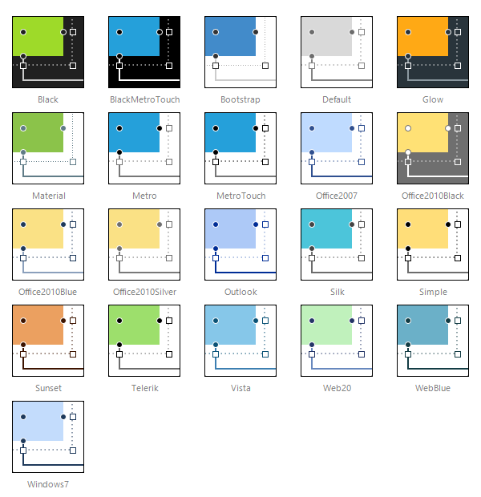

# Skins

**RadDiagram** uses **skins** to control its overall look-and-feel. A skin is a set of images and a CSS stylesheet that can be applied to the control elements (items, images, etc.) and defines their appearance.

To apply a skin to a **RadDiagram** control, set its **Skin** property.

**RadDiagram** is installed with a number of preset skins. These are shown below:

# See Also

 * [ASP.NET Diagram Control Product Overview]()

 * [RadDiagram Getting Started]()