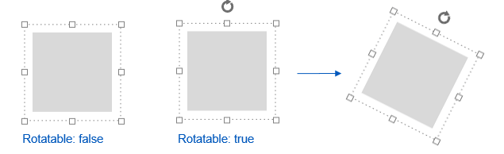
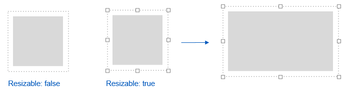
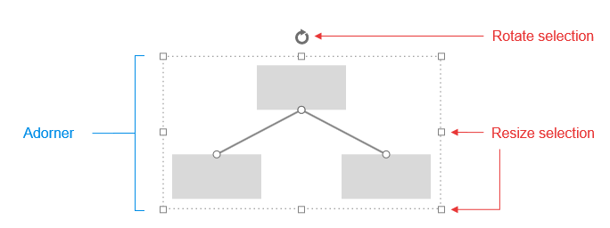

# Rich User Interaction

The **RadDiagram** control lets the user interact with the elements of the diagram in many different ways. You can find all of the available actions in the following sections. They are enabled by default, so you should be able to use them if you have not changed the properties that control them. You can find information about these properties in the [Server-Side API of the control]().

## Rotate

You can rotate the shapes in this interactive and easily customizable ASP.NET diagram. To do so, click on a shape in order to display the adorner (a dashed rectangle with resize handles around the shape). You will notice the rotating icon that is shown above the shape in **Figure 1**. Click on it and start dragging to rotate the shape in the selected direction.

>caption **Figure 1**: Rotating shapes.

## Resize

You can resize the shapes via the adorner that is displayed when a shape is clicked. Drag the respective handle in the desired resizing direction as shown in **Figure 2**.

>caption **Figure 2**: Resizing shapes.

## Translate

The diagram control allows you to move the shapes easily. Just click on a shape and start dragging it.

## Pan

Panning is a translation that is applied to the whole diagram. You can pan a diagram by holding down **Ctrl**, clicking on an area of the diagram that is not occupied by a shape or a connection and then start dragging. The cursor move icon () will appear to indicate that you can start the pan operation.

## Zoom

You can change the zoom level of the whole diagram via the mouse wheel.

>note The zoom step when using the mouse-wheel to zoom in or out is controlled by the **ZoomRate** property of **RadDiagram** . Setting zoom rate to 0 will disable zooming:`RadDiagram1.ZoomRate = 0;`

## Undo and Redo

You can utilize the standard keyboard shortcuts **Ctrl** + **Z** and **Ctrl** + **Y** in order to undo and redo the performed operations respectively.

## Selection

You can select multiple shapes and connections by clicking on an area in the diagram outside of a shape or a connection, holding down the left mouse button and dragging.When you do this, you will see the selection rectangle showcased in **Figure 3**. You will select all shapes that are partially or fully wrapped in this rectangle when you release the mouse button. An adorner, similar to the one in **Figure 3**, will appear around all shapes and connections in the selection. You can use this adorner to operate(**Rotate**, **Resize** and **Translate**) on all shapes in the selection.

>caption **Figure 3**: Selecting multiple shapes.

## Connecting Shapes

You can easily connect diagram shapes by left-clicking on a shape connector and then dragging the end cap of the created connection line to a connector of another shape. This creates a line that connects both shapes and represents a connection in the diagram. There are some specific scenarios that you can encounter while connecting shapes:

* When you start drawing the connection from the first connector, you can leave the end cap of the connection without placing it on a connector. Later you can pick it up and finish the connection. It is also possible to start dragging a connection's cap that is already placed in a connector in order to connect it to another shape. For this purpose, you first need to click on the connection to select it (this action will mark the connection's caps as shown in **Figure 4**), then click on one of the caps and start dragging it to its new location. Selecting the connection first is required so that you do not start drawing a new connection instead of picking up the cap of the current one.

	>caption **Figure 4**: Selecting a connection.

	

* Each shape has five connectors by default - four for the top, right, bottle and left directions and one auto connector in the center of the shape. If you connect two shapes using the direction connectors and start translating one of the shapes, the connection's caps will remain on the connectors, in which you placed them. If you place a connection's cap on an auto connector, however, this end of the connection will move so that both shapes are always connected with the shortest connection possible.

## Deleting Shapes and Connections

You can delete each shape and connection in the diagram by clicking on them and pressing the **Delete** keyboard button.

# See Also

 * [RadDiagram Element Structure]()

 * [RadDiagram Server-Side Programming]()

 * [RadDiagram Client-Side Programming]()