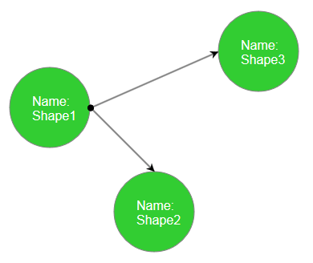

# Shape Templates

You can fully control where and how data is displayed in the **RadDiagram** shapes by defining a visual template. This requires the creation of a function, which uses the [Kendo UI Diagram API](http://docs.telerik.com/kendo-ui/api/dataviz/diagram#configuration-shapeDefaults.visual) for defining the visual element to render. You can set the name of this function in two properties of the diagram control:

* The **ShapeDefaultsSettings-Visual** inner property of **RadDiagram** controls the template of all shapes, so if you set the function name here, the template will be applied to all of them.

* If you use the **Visual** property of a **DiagramShape** object in the diagram, the template will be applied to that particular shape.

**Example 1** creates the diagram with circles in **Figure 1** rather than the default rectangular shapes.

>caption **Figure 1**: Shapes with configured template.



>caption **Example 1**: Client-side function that creates a template with green circles and white text for the shapes in the diagram.

````ASP.NET
<script type="text/javascript">
	var visualTemplate = function (options) {
		var diagram = kendo.dataviz.diagram;

		var group = new diagram.Group({
			autoSize: true
		});

		var circle = new diagram.Circle({
			width: 100,
			height: 100,
			fill: "#32CD32"
		});
		group.append(circle);

		var textBlock1 = new diagram.TextBlock({
			text: "Name:",
			color: "#ffffff",
			fontSize: 16,
			x: 28,
			y: 32
		});

		group.append(textBlock1);

		var textBlock2 = new diagram.TextBlock({
			text: options.id,
			color: "#ffffff",
			fontSize: 16,
			x: 28,
			y: 50
		});

		group.append(textBlock2);
		return group;
	};
</script>

<telerik:RadDiagram ID="diagram1" runat="server">
	<ShapeDefaultsSettings Visual="visualTemplate"></ShapeDefaultsSettings>
	<ShapesCollection>
		<telerik:DiagramShape Id="Shape1" X="100" Y="110">
		</telerik:DiagramShape>
		<telerik:DiagramShape Id="Shape2" X="230" Y="240">
		</telerik:DiagramShape>
		<telerik:DiagramShape Id="Shape3" X="360" Y="40">
		</telerik:DiagramShape>
	</ShapesCollection>
	<ConnectionsCollection>
		<telerik:DiagramConnection StartCap="FilledCircle" EndCap="ArrowEnd">
			<FromSettings ShapeId="Shape1" Connector="Right" />
			<ToSettings ShapeId="Shape2" Connector="Top" />
		</telerik:DiagramConnection>
		<telerik:DiagramConnection StartCap="FilledCircle" EndCap="ArrowEnd">
			<FromSettings ShapeId="Shape1" Connector="Right" />
			<ToSettings ShapeId="Shape3" Connector="Left" />
		</telerik:DiagramConnection>
	</ConnectionsCollection>
</telerik:RadDiagram>
````

# See Also

 * [Kendo UI Diagram API for creating visual templates](http://docs.telerik.com/kendo-ui/api/dataviz/diagram#configuration-shapeDefaults.visual)

 * [RadDiagram Server-Side Programming]()

 * [RadDiagram Client-Side Programming]()